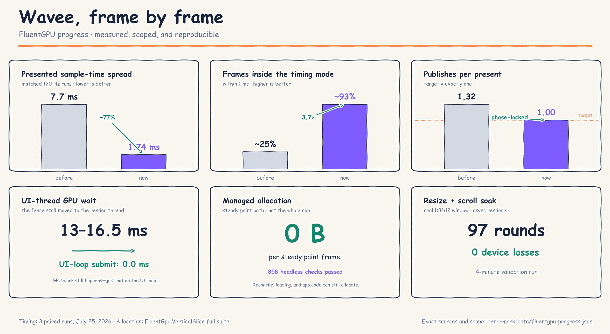
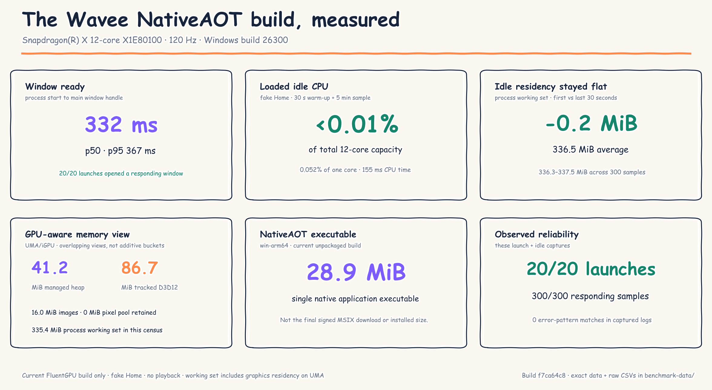

# Wavee is changing engines—and the numbers are finally worth sharing

WaveeMusic started as a UWP app in 2020, became a real WinUI 3 application, and finally shipped as an MSIX this year. The next version is now running on something very different: FluentGPU, a NativeAOT, Direct3D 12 UI engine I built from scratch for Wavee.

This is not a mock-up and it is no longer just framework work. The live Spotify catalog, library, playback, Connect, lyrics, video surfaces, settings, and Wavee's dense detail pages are running on the new engine.

The last few months were mostly about removing the reasons a music app can report a high frame rate and still feel bad:

- hot scalar updates became compositor bindings instead of page re-renders;
- the retained scene moved to struct-of-arrays storage with scoped layout;
- image decode/upload became bounded and scroll-aware;
- virtual lists gained realization budgets and direction-aware overscan;
- large-tree property comparisons stopped boxing values during every diff;
- opaque occlusion culling removed nested overdraw;
- GPU submit/present moved to a dedicated render thread;
- the UI producer became phase-locked to the display instead of free-running against it.

## The scroll result

On three matched synthetic runs on a 120 Hz panel:

- presented sample-time spread narrowed from **7.7 ms to 1.74 ms** (**77% tighter**);
- frames within 1 ms of the modal timing rose from roughly **25% to 93%**;
- publishes per present fell from **1.32 to exactly 1.00**;
- the median present interval stayed at **8.31 ms**.

That last line is important. This was not a trick that raised an FPS counter. Present cadence was already close to 120 Hz. The problem was that the UI loop produced frames at wandering points between vblanks, so the *positions that reached the screen* were sampled unevenly. FluentGPU now produces one frame for one present, in phase with the display.

The async render thread also moved a measured **13–16.5 ms GPU fence stall** off the UI loop; UI-side submit measured **0.0 ms** in the real-GPU validation run.

That validation also completed a four-minute real-window resize/scroll soak—**97 rounds with zero device-loss failures**.

## What “zero allocation” actually means

The steady paint path currently performs **0 B of managed allocation per frame**, enforced by the full 858-check headless suite. Scroll input dispatch, compositor bindings, timers, text recording, icons, and the cadence instrumentation have their own zero-allocation gates.

That does **not** mean the entire app allocates nothing. Loading data, decoding payloads, building new element trees, reconciliation, and application code still allocate. The cadence capture intentionally disabled allocation probes so the probes could not perturb the timing being measured; there is no honest same-run allocation-rate before/after number to publish.

An earlier mixed-navigation diagnostic sampled a 5.5 MB/s median and 27.8 MB/s p95 allocation rate, with much larger cold-navigation spikes. That is why the work also removed boxed large-tree comparisons, broad playback subscription fan-out, unbounded image work, and one-shot content swaps. One captured detail transition previously landed as a single roughly 80 ms frame with a Gen 2 collection; it is now revealed in bounded chunks.

So the claim is intentionally narrow: **settled painting and composition do not feed the GC; the allocating edges are being measured and reduced separately.**

## The current NativeAOT Wavee build

I measured the actual win-arm64 Wavee executable currently on disk, build `0.1.1-dev+f7ca64c8`, on a 12-core Snapdragon X1E-80 machine with an Adreno X1-85 iGPU and a 120 Hz display:

- **20/20** launches opened a responding window;
- warm process-to-window readiness measured **332 ms p50** and **367 ms p95** across 19 runs;
- five minutes of loaded fake-Home idle averaged **under 0.01% of total 12-core CPU capacity**—about **0.052% of one core**;
- an instrumented post-startup memory census measured **1.55 KiB/s median whole-process allocation** (0.8–1.6 KiB/s), including the census reporter's own overhead;
- all **300/300** one-second idle samples remained responsive;
- the final 30-second working-set average was **0.2 MiB lower** than the first 30-second average;
- the unpackaged NativeAOT executable is **28.9 MiB**.

Memory needs one extra sentence on this hardware. The 335.4 MiB process working set includes graphics/native residency on the UMA iGPU. A separate census reported 41.2 MiB managed heap, 86.7 MiB of tracked live D3D12 resources, 16.0 MiB of ready image-cache payload, and no pixel-pool buffers retained after loading. Those are overlapping views, not additive buckets.

These are current-FluentGPU measurements, not WinUI improvement ratios. They measure window readiness rather than first present, and the fake Home surface had no playback or user input. Another Wavee instance remained open during this developer-machine snapshot, although every sample was attached to the benchmark-owned PID. The [curated JSON and raw samples](benchmark-data/fluentgpu-binary-2026-07-26.json) are included with the repository.

## When can people install it?

My target is a **first public, signed FluentGPU experimental MSIX in August 2026**.

That is a target window, not a promise tied to an arbitrary Friday. The build goes public when:

- install, launch, update, uninstall, and package identity work cleanly;
- authentication, library sync, playback, Connect, and recovery pass smoke tests;
- sustained navigation, scrolling, and resizing survive soak testing without device loss or runaway memory;
- current experimental-channel users have a safe migration path.

The current WinUI 3 app remains available as a signed MSIX in the meantime. The FluentGPU build will be a real installable package—not a source-only preview—and I will publish the exact date once those gates are green.

## What gets measured before the MSIX ships

The next result drop will compare the signed WinUI 3 and FluentGPU packages on the same machine, display, power mode, account, and scripted content. The public comparison will cover:

- cold and warm launch to first presented frame and interactive shell;
- warm and cold album, artist, and playlist navigation latency;
- missed-vsync rate plus p50/p95/p99 present intervals during fixed 120 Hz scroll workloads;
- working set, private bytes, managed heap, allocation rate, GC count, and GC pause during a separate ten-minute navigation run;
- five-minute idle CPU/GPU use, installed MSIX footprint, and a 30-minute reliability soak.

Cadence and allocation are intentionally separate captures: allocation diagnostics can perturb the timing being measured. Each comparison needs clean release builds, repeated runs, commit/package identities, and raw artifacts before it appears as a percentage claim.

The current generic CPU/memory bench remains diagnostic-only and its July output is excluded from the public WinUI-versus-FluentGPU comparison. The complete protocol, audit notes, and publication rules are in [PERFORMANCE-BENCHMARKS.md](PERFORMANCE-BENCHMARKS.md).

## Sources and reproducibility

- [Display phase-lock implementation and paired-run results](https://github.com/christosk92/fluent-gpu/commit/b4d97629a88ee6a6c136db003a75123abc42be72)
- [Lost-wake correction and re-measured three-run results](https://github.com/christosk92/fluent-gpu/commit/b17788d99f9249f18bf7337eca1ec5fc76b568cb)
- [Async render thread real-GPU validation](https://github.com/christosk92/fluent-gpu/commit/f03ca725f0fcdb2fbf5e1f321b1dbb139034b454)
- [Bounded cold detail reveal](https://github.com/christosk92/fluent-gpu/commit/bdb54ba704e0a7a5adda51e4ec196323f75abc90)
- [Curated chart data](benchmark-data/fluentgpu-progress.json)
- [Reproducible Matplotlib chart generator](eng/generate-fluentgpu-progress-chart.py)
- [Current NativeAOT binary measurements](benchmark-data/fluentgpu-binary-2026-07-26.json)
- [NativeAOT measurement chart generator](eng/generate-fluentgpu-binary-chart.py)

---

### Short version for social posts

WaveeMusic's FluentGPU rewrite is now running the real app, and recent 120 Hz scroll work produced a measurable change:

**7.7 → 1.74 ms** presented sample-time spread 
**~25% → ~93%** of frames inside the 1 ms timing mode 
**1.32 → 1.00** publishes per present 
**0 B** managed allocation on the steady paint path

The FPS counter was already high; the missing piece was even, display-locked sampling. The first public signed experimental MSIX is targeted for **August 2026**, once packaging, playback, update, and soak gates are green.
