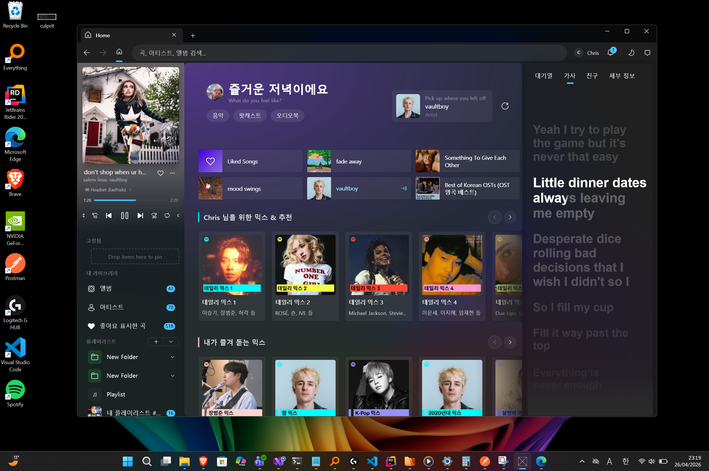
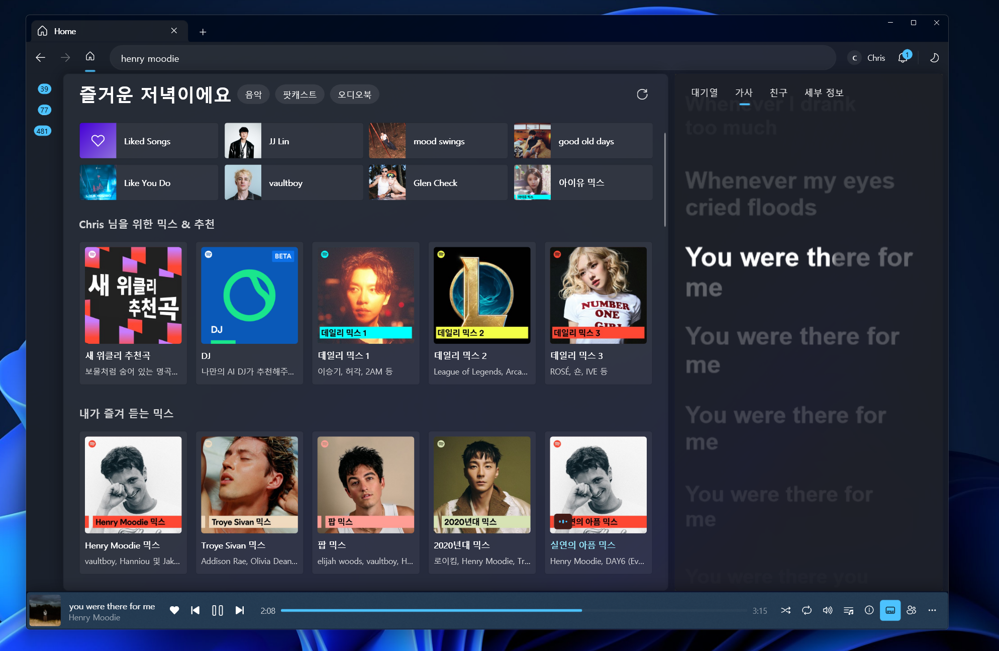
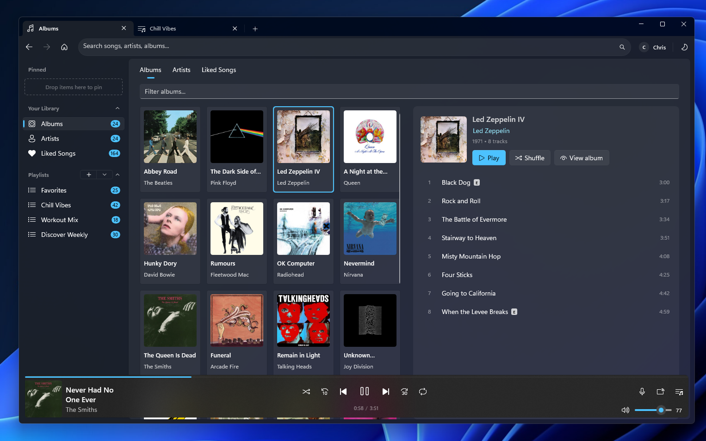
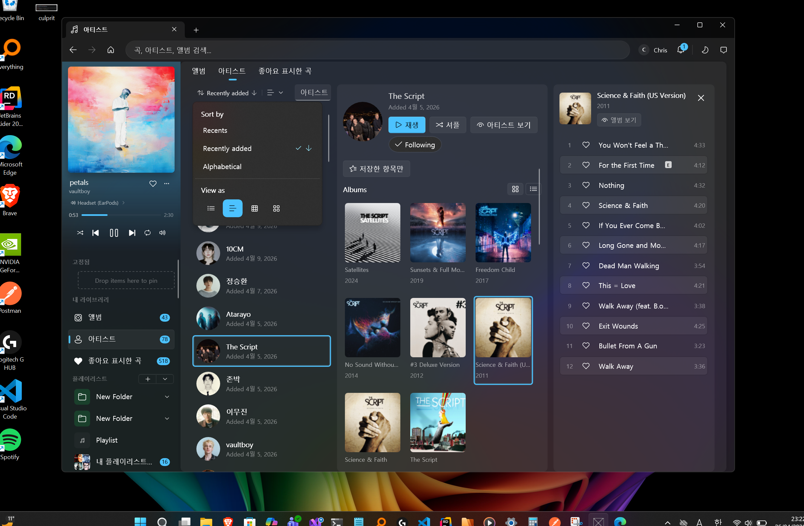
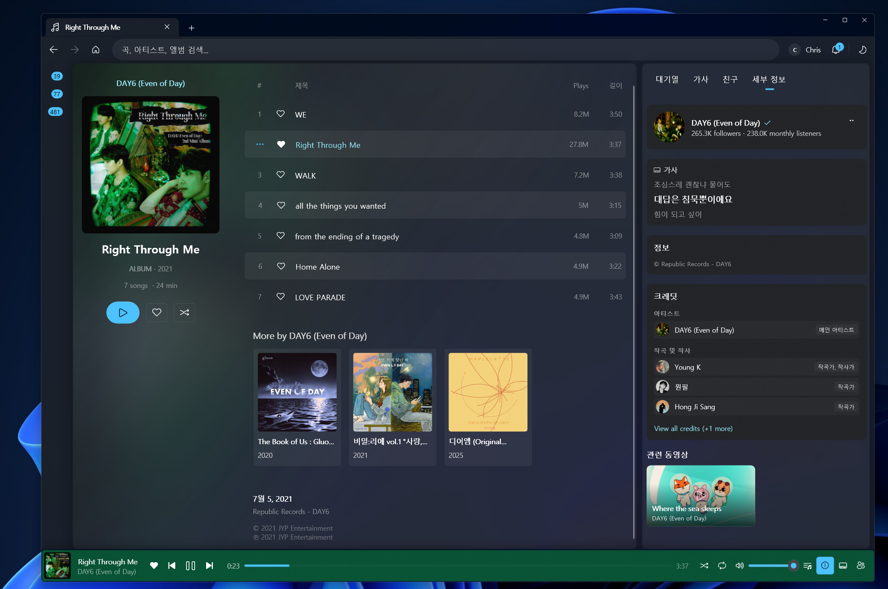
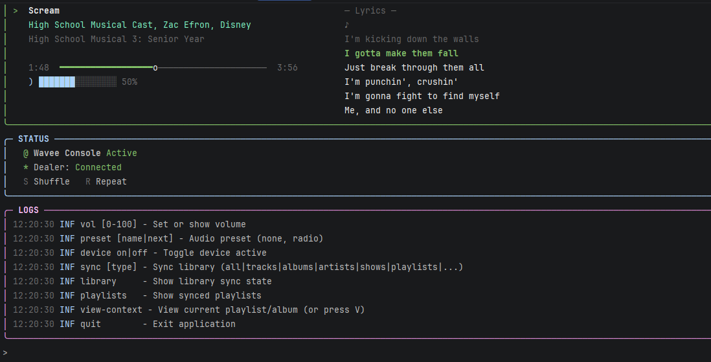

# WaveeMusic

A modern, open-source Spotify desktop client for Windows — built with .NET 10 and WinUI 3.




## What it is

Wavee is an alternative client for Spotify on Windows. Under the hood it's a clean‑room reimplementation of Spotify's Access Point, Connect, Mercury, and metadata protocols — the same ones the official client speaks — wrapped in a polished WinUI 3 desktop app.

A **Spotify Premium** account is required, and the app is intended for personal use.

## Features

### Desktop app
- **Home, Search, Library** — liked songs, saved artists, saved albums, playlists.
- **Artist, Album, Playlist pages** — full discography, top tracks, biography, related, color extraction from art.
- **Browser-style tabs** with pin / drag-and-drop / context menus, plus a sidebar for navigation and an expandable now‑playing pane.
- **Music videos** — Spotify videos play with PlayReady DRM via WebView2; local videos play through the platform media player.
- **Lyrics** — synced lyrics with shader effects, multi‑language detection, and CJK romanization (pinyin / kana).
- **Local file library** — index audio and video files from disk, browse them alongside Spotify content.
- **Friends feed**, **profile**, **concerts**, in‑app **settings** (theme, audio device, EQ, language, diagnostics).
- **On-device AI on Copilot+ PCs** (opt-in) — explain a lyric line or summarize a song's themes with Phi Silica running locally on the NPU. Nothing leaves the machine; off by default.

### Spotify Connect
- Full Dealer WebSocket implementation, real‑time cluster state synchronization.
- Device picker for transferring playback between devices.
- Volume sync, queue updates, remote command handling — works as both controller and target.

### Audio
- Audio runs in a separate process (`Wavee.AudioHost`) over named‑pipe IPC, so audio engine crashes don't take the UI down.
- BASS for decode + DSP, NVorbis for Ogg Vorbis decryption, PortAudio for cross‑arch output.
- 10‑band equalizer, normalization (loudness), and crossfade between tracks.

### Authentication
- OAuth 2.0 — both **Authorization Code with PKCE** (browser flow) and **Device Code** flow.
- Credentials cached encrypted on disk via Windows DPAPI, so you only sign in once.

### Architecture highlights
- **.NET 10** with Native AOT compatibility on the core library and console.
- **MVVM + DI** in the desktop app (`Microsoft.Extensions.DependencyInjection`, `CommunityToolkit.Mvvm`, `ReactiveUI`).
- **Single-project MSIX** packaging for x86 / x64 / ARM64.

## Screenshots

### Desktop app

<table>
  <tr>
    <td></td>
    <td></td>
  </tr>
  <tr>
    <td colspan="2"></td>
  </tr>
  <tr>
    <td colspan="2"></td>
  </tr>
</table>

### Console



## Quick start

### Prerequisites
- **Windows 11 version 24H2 (build 26100)** or later — required since v0.1.0-beta to enable on-device AI features.
- .NET 10 SDK
- A Spotify **Premium** account

### Run the desktop app

```bash
git clone https://github.com/christosk92/WaveeMusic.git
cd WaveeMusic
dotnet run --project src/Wavee.UI.WinUI
```

### Run the console app

```bash
dotnet run --project src/Wavee.Console
```

## Project structure

```
WaveeMusic/
├── Wavee/                          # Core protocol library (auth, Connect, audio orchestration, metadata)
├── Wavee.UI/                       # Framework-neutral UI service layer (no XAML)
├── Wavee.UI.WinUI/                 # WinUI 3 desktop app (the headline client)
├── Wavee.Controls.Lyrics/          # Lyrics rendering library (D2D shaders, language detect, romanization)
├── Wavee.AudioHost/                # Out-of-process audio runtime (BASS + NVorbis + PortAudio, x64-only)
├── Wavee.Playback.Contracts/       # Shared IPC contracts between WinUI app and AudioHost
├── Wavee.Console/                  # AOT-compiled CLI client (Spectre.Console + Docker-friendly)
├── Wavee.Tests/                    # Tests for the core library
├── Wavee.UI.Tests/                 # Tests for the UI service layer
├── Wavee.PlayPlay.Tests/           # PlayPlay decryption tests
├── Lyricify.Lyrics.Helper/         # Vendored: multi-provider lyrics search (QQ, Kugou, Netease)
├── NVorbis/                        # Vendored: managed Ogg Vorbis decoder
└── Wavee.slnx                       # Solution
```

Each first‑party project has its own README with developer-facing details:
[Wavee](Wavee/README.md) ·
[Wavee.UI](Wavee.UI/README.md) ·
[Wavee.UI.WinUI](Wavee.UI.WinUI/README.md) ·
[Wavee.Controls.Lyrics](Wavee.Controls.Lyrics/README.md) ·
[Wavee.AudioHost](Wavee.AudioHost/README.md) ·
[Wavee.Playback.Contracts](Wavee.Playback.Contracts/README.md) ·
[Wavee.Console](Wavee.Console/README.md) ·
[Wavee.Tests](Wavee.Tests/README.md) ·
[Wavee.UI.Tests](Wavee.UI.Tests/README.md) ·
[Wavee.PlayPlay.Tests](Wavee.PlayPlay.Tests/README.md).

## Building

```bash
# Build entire solution
dotnet build

# Release build
dotnet build -c Release

# Run tests
dotnet test
```

`Wavee.UI.WinUI` builds `Wavee.AudioHost` automatically as an x64 subprocess (via the `BuildAudioHost` MSBuild target). This is normal even on ARM64 Windows — the audio host loads `Spotify.dll` (x86_64) for PlayPlay key derivation, and the OS runs it under built-in x64 emulation. See [Wavee.AudioHost/README.md](Wavee.AudioHost/README.md) for the why.

## Technology stack

| Component       | Technology                                                                 |
|-----------------|----------------------------------------------------------------------------|
| **Framework**   | .NET 10, C# preview                                                        |
| **UI**          | WinUI 3, Windows App SDK 2.0, CommunityToolkit, ReactiveUI                 |
| **Audio**       | BASS (DSP), NVorbis (Ogg), PortAudio (output) — out-of-process             |
| **Protocols**   | Protocol Buffers (Google.Protobuf), WebSocket, Mercury, ZStandard, Shannon |
| **Reactive**    | System.Reactive (Rx.NET)                                                   |
| **MVVM / DI**   | CommunityToolkit.Mvvm, Microsoft.Extensions.DependencyInjection / Hosting  |
| **Storage**     | SQLite (Microsoft.Data.Sqlite) for library / playlist cache                |
| **Logging**     | Serilog                                                                    |
| **Lyrics**      | ComputeSharp.D2D1.WinUI, NTextCat, csharp-pinyin, WanaKana                 |

## Gabo events (telemetry)

Wavee posts the bare minimum set of playback events Spotify's backend needs to credit your plays toward Recently Played, play counts, and the "made for you" recommendations you already get from any official client. Everything goes to `https://spclient.wg.spotify.com/gabo-receiver-service/v3/events/`.

The legacy `event-service/v1/events` path (both Mercury and HTTPS variants) returns 404 — gabo is the only working transport, and our event surface is built around it.

### Events sent — playback only

| Event | When | What |
|---|---|---|
| `RawCoreStream` | At the end of each track | Track URI, context URI, ms played, reason started/ended, audio format. **This is the play-history event** — Recently Played and play counts both come from here. |
| `RawCoreStreamSegment` | Per pause/resume/seek split inside a track | Same playback id + segment ms range |
| `AudioSessionEvent` | When playback opens/seeks/closes | Session lifecycle markers |
| `BoomboxPlaybackSession` | Once per track | Buffering / resolve / setup latencies + duration |
| `Download`, `HeadFileDownload` | Per CDN fetch | File id, bytes, latency |
| `CorePlaybackCommandCorrelation` | When a play command runs | Maps command id → playback id |
| `ContentIntegrity` | Per track | Playback id + a flag stating we played in real-time (not ripping) |

### Events Wavee deliberately does NOT send

The desktop client sends these; we don't because none of them are required to make Recently Played work:

- **Ad pipeline** — `AdEvent`, `AdRequestEvent`, `AdOpportunityEvent`, `AdSlotEvent`. Premium-only client, no ads.
- **UI interaction telemetry** — `DesktopUIShellInteractionNonAuth`, `WindowSizeNonAuth`.
- **System / driver fingerprinting** — `AudioDriverInfo`, `WasapiAudioDriverInfo`, `ModuleDebug`, `ConfigurationFetched`, `TimeMeasurement`, `ClientRuntimeDiag`.
- **Library / cache reports** — `LocalFilesReport`, `CacheReport`, `OfflinePruneReport`, `CollectionEndpointUsage`.
- Anything else from the 100+ event types defined in Spotify's binary.

### How it's wired

| File | Role |
|---|---|
| `src/Wavee/Connect/Events/EventService.cs` | Posts each `IPlaybackEvent` (one envelope per POST in v1; client-side batching can be layered later). Exposes `IObservable<IPlaybackEvent>` so in-process subscribers can mirror what's sent. |
| `src/Wavee/Connect/Events/GaboEnvelopeFactory.cs` | Builds the protobuf envelope. The per-event payload is one `EventFragment`; the rest of the fragments are the **context block** — client id, installation id, application/device descriptors, time, SDK. |
| `src/Wavee/Connect/Events/IPlaybackEvent.cs` | Interface for one event type. Implementations: `RawCoreStreamPlaybackEvent`, `RawCoreStreamSegmentPlaybackEvent`, `AudioSessionPlaybackEvent`, `BoomboxPlaybackSessionEvent`, `DownloadPlaybackEvent`, `HeadFileDownloadPlaybackEvent`, `CorePlaybackCommandCorrelationEvent`, `ContentIntegrityPlaybackEvent`. |
| `src/Wavee/Core/Http/SpClient.cs` (`PostGaboEventAsync`) | The actual HTTPS POST. |

### Mimicry of the desktop client (anti-fraud avoidance)

Spotify's anti-fraud pipeline drops batches whose context block doesn't look like a first-party client. To stay below that bar, the envelope's `context_sdk` fragment uses the same `sdk_version_name` and `sdk_type` strings the C++ desktop client emits, the `application_desktop` fragment carries the desktop client's app version (`1.2.88.483` / version code `128800483`), and the device-context fragments use the real machine's BIOS manufacturer/model + OS version + Windows machine SID. The breakthrough is documented inline in `GaboEnvelopeFactory.cs`. If you change the SDK strings or version code, expect Recently Played to silently stop working.

## What's NOT in this repo (proprietary)

Three Spotify-property files are deliberately excluded from the public source tree. The build still compiles without them — stubs are provided where needed — but a few features are degraded or disabled.

| Excluded file | What it does | Effect of the stub |
|---|---|---|
| `src/Wavee/Core/Crypto/AudioDecryptStream.cs` | AES-128-CTR Big-Endian decryption for Spotify audio files (matches librespot's `audio/src/decrypt.rs`). Provides streaming decrypt with arbitrary seeking. | The file is excluded entirely (no stub). Test fixtures (`test/Wavee.Tests/Core/Crypto/...`) document what *would* be tested. Without it, you cannot decrypt encrypted Spotify Ogg streams in this repo's open form. |
| `src/Wavee/Core/Audio/PlayPlayConstants.cs` | Spotify-specific constants used to derive PlayPlay AES keys directly from `Spotify.dll`, used as a fallback when the AP audio-key channel returns a permanent error. | `PlayPlayConstants.Stub.cs` ships in its place; the runtime feature stays disabled. `AudioKeyManager` falls back to AP-only key resolution. |
| `src/Wavee.AudioHost/PlayPlay/PlayPlayKeyEmulator.cs` | The actual emulator that loads `Spotify.dll` (x86_64) in-process and exercises PlayPlay. | `PlayPlayKeyEmulator.Stub.cs` ships in its place. `Wavee.PlayPlay.Tests` runs against the stub and skips the real test vectors. |

**Why excluded:** these files reproduce Spotify's DRM (the AES decryption stream) and proprietary key-derivation data (PlayPlay constants embedded in `Spotify.dll`). Both are part of Spotify's intellectual property; we're not in a position to redistribute them. The connection-protocol layer (handshake, Shannon cipher, packet framing) is fully open and included — see [Wavee/Core/Crypto/README.md](Wavee/Core/Crypto/README.md) for the legal note.

**What still works without them:** authentication, session management, Spotify Connect (full controller + target), all metadata APIs (SpClient + Pathfinder), the WinUI app's UI, library sync, search, lyrics, music videos via PlayReady, Connect command issuance, telemetry — everything except the actual decryption of Spotify-encrypted audio files. If you need to play encrypted streams, you'll need to implement audio decryption yourself or obtain proper licensing.

## License

MIT — see [LICENSE](LICENSE).

## Disclaimer

This project is not affiliated with, endorsed by, or sponsored by Spotify AB. All trademarks are property of their respective owners. WaveeMusic is for educational and personal use only. Users must comply with Spotify's Terms of Service and have a valid Spotify Premium subscription.

---

**Status**: Active development · **Platform**: Windows 11 24H2+
