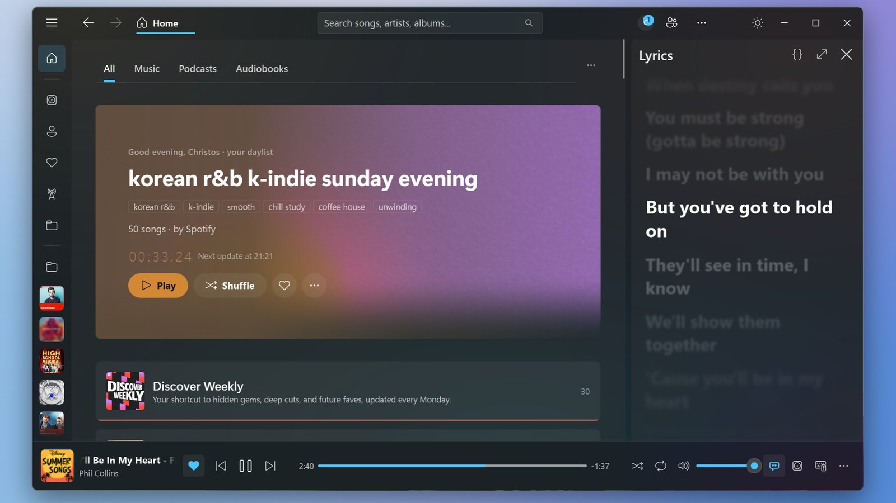
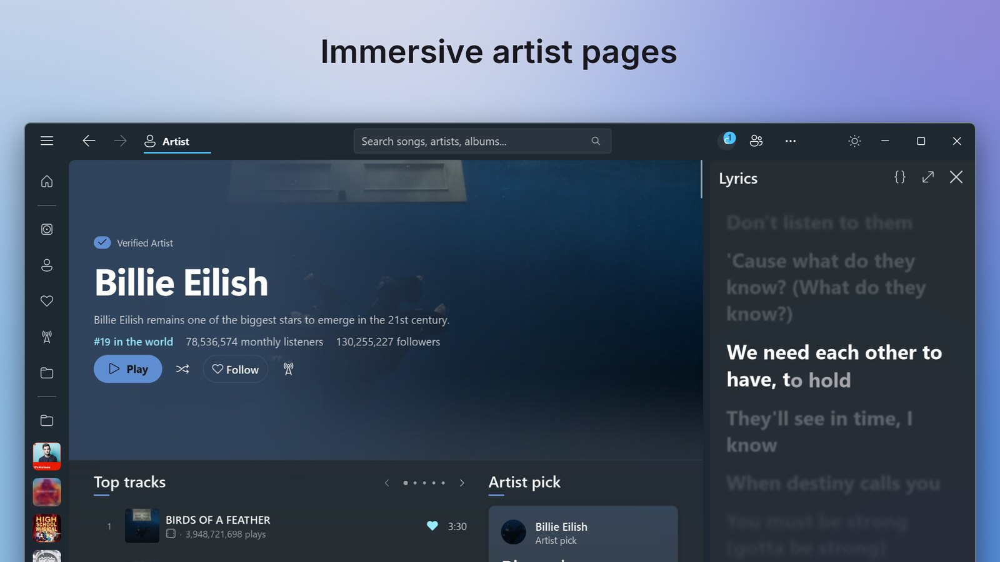
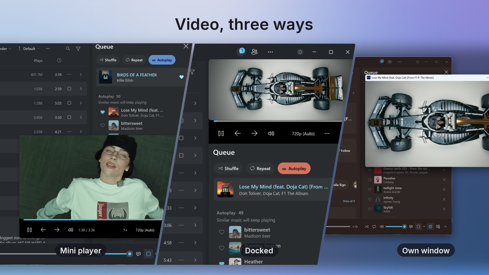
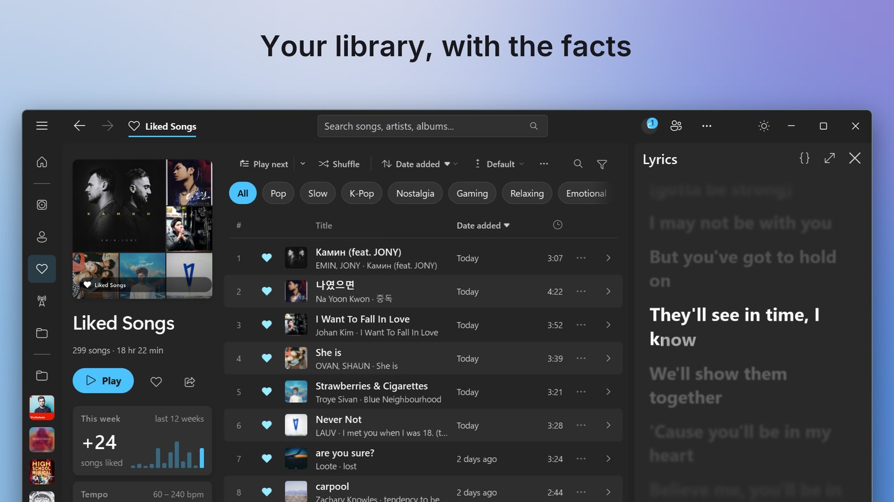
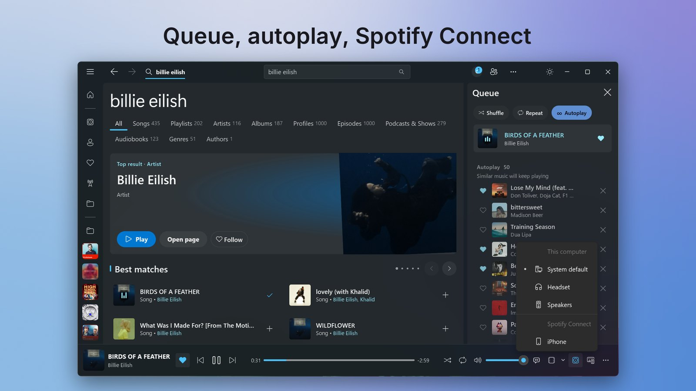
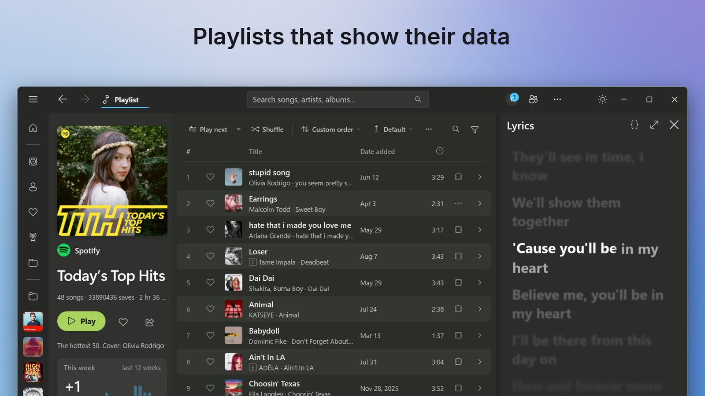

<p align="center">
  
</p>

<h1 align="center">Wavee</h1>

<p align="center">
  A Spotify desktop client for Windows 11, built on <a href="https://github.com/christosk92/fluent-gpu">FluentGpu</a> —
  a from-scratch, NativeAOT, GPU-rendered UI engine for .NET 10.
</p>

<p align="center">
  <a href="https://github.com/christosk92/WaveeMusic/releases/tag/wavee-stable"></a>
  <a href="https://github.com/christosk92/WaveeMusic/releases"></a>
  
  <a href="https://github.com/christosk92/fluent-gpu"></a>
  <a href="LICENSE"></a>
</p>

<p align="center">
  <a href="https://github.com/christosk92/WaveeMusic/releases/download/wavee-stable/Wavee.x64.appinstaller">
    <picture>
      <source media="(prefers-color-scheme: light)" srcset="assets/readme/DownloadInstaller-x64-dark.png" height="64" />
      </picture></a>
  &ensp;
  <a href="https://github.com/christosk92/WaveeMusic/releases/download/wavee-stable/Wavee.arm64.appinstaller">
    <picture>
      <source media="(prefers-color-scheme: light)" srcset="assets/readme/DownloadInstaller-arm64-dark.png" height="64" />
      </picture></a>
  &ensp;
  <a href="https://apps.microsoft.com/detail/9NJPVWTQPT9H">
    </a>
</p>


One ~30 MB MSIX, no bundled runtime, Mica, dynamic accent, 10k-row virtualized lists, synced lyrics, video,
out-of-process playback modules (YouTube / Twitch / radio).

> Wavee is an independent client for your own Spotify **Premium** account. It is not made by, endorsed by, or
> affiliated with Spotify AB. Privacy statement: [PRIVACY.md](PRIVACY.md).

## A quick look

| | |
|---|---|
|  |  |
|  |  |
|  |  |

## Install

Two ways in, same app:

- **Microsoft Store** — [apps.microsoft.com/detail/9NJPVWTQPT9H](https://apps.microsoft.com/detail/9NJPVWTQPT9H):
  install and update through the Store.
- **Direct download** — the buttons above; signed MSIX from this repository's releases, silent auto-updates.

Click the button for your architecture (x64 for most PCs, ARM64 for Snapdragon / Surface Pro X-class devices) and
open the downloaded `.appinstaller` — Windows App Installer installs the signed package. Updates are checked in the
app (Settings › About) and applied silently by App Installer on launch; the rolling
[`wavee-stable`](https://github.com/christosk92/WaveeMusic/releases/tag/wavee-stable) release is what every install
polls. Prefer a manual install? Every version's `.msix` is on its own
[release](https://github.com/christosk92/WaveeMusic/releases), next to its symbols. Release notes:
[CHANGELOG.md](CHANGELOG.md) and the **What's new** page inside the app.

Requires Windows 11 and a Spotify Premium account.

## Build

The engine is a **sibling checkout**, not a package:

```powershell
git clone https://github.com/christosk92/fluent-gpu C:\wavee\fluent-gpu
git clone https://github.com/christosk92/WaveeMusic C:\wavee\WaveeMusic
cd C:\wavee\WaveeMusic
git config core.hooksPath .githooks
dotnet build Wavee.slnx -c Release
dotnet run --project src/apps/Wavee              # or:  -- --fake  for the offline demo data
```

Requirements: .NET SDK 10+ (`global.json` rolls forward), Visual Studio Build Tools with MSVC (NativeAOT link),
Windows 11. The Spotify playback derivation (`src/apps/Wavee.PlayPlay`) lives in a private repository and is
junctioned in per checkout — a checkout without it builds the public-only variant.

## Repository layout

| Path | What |
|---|---|
| `src/apps/Wavee` | the app (composition root, features, backend, platform) |
| `src/apps/Wavee.Core` | engine-free app logic (release notes, versioning, update policy, notifications) |
| `src/apps/Wavee.Sdk`, `src/apps/modules/*` | the playback-module SDK and the first-party modules |
| `src/apps/Wavee.Tests` | xUnit tests (pure logic — never source-text tests) |
| `src/apps/Wavee.ReleaseTool` | validates/renders release notes for a release |
| `ops/build`, `ops/release` | MSIX packaging, signing, the local release runbook and its E2E harness |
| `docs/guide`, `docs/plans` | app guides (releasing, playback modules, sidebar platform) and plans |

Releasing: [`docs/guide/releasing-wavee.md`](docs/guide/releasing-wavee.md). Agent guidance: `CLAUDE.md`, `AGENTS.md`.

## License

MIT — see [LICENSE](LICENSE). Third-party components: [THIRD-PARTY-NOTICES.txt](THIRD-PARTY-NOTICES.txt).
