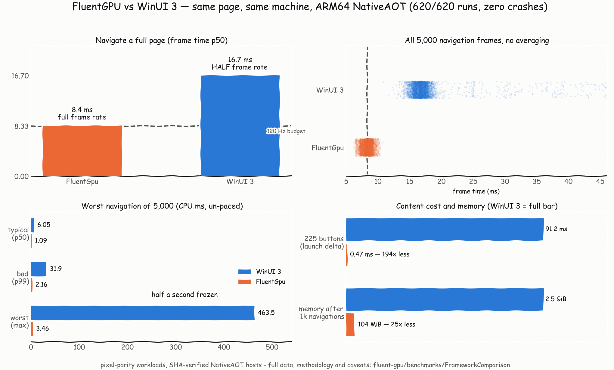
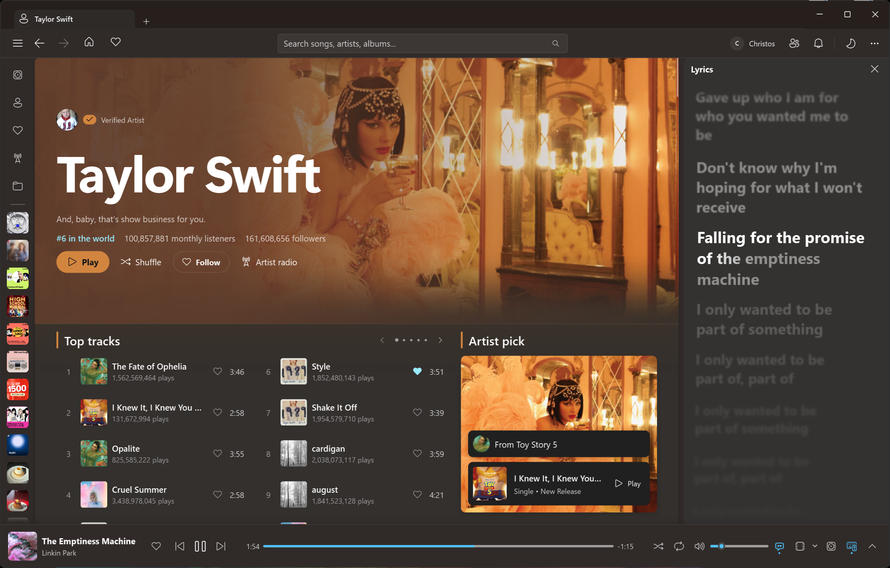
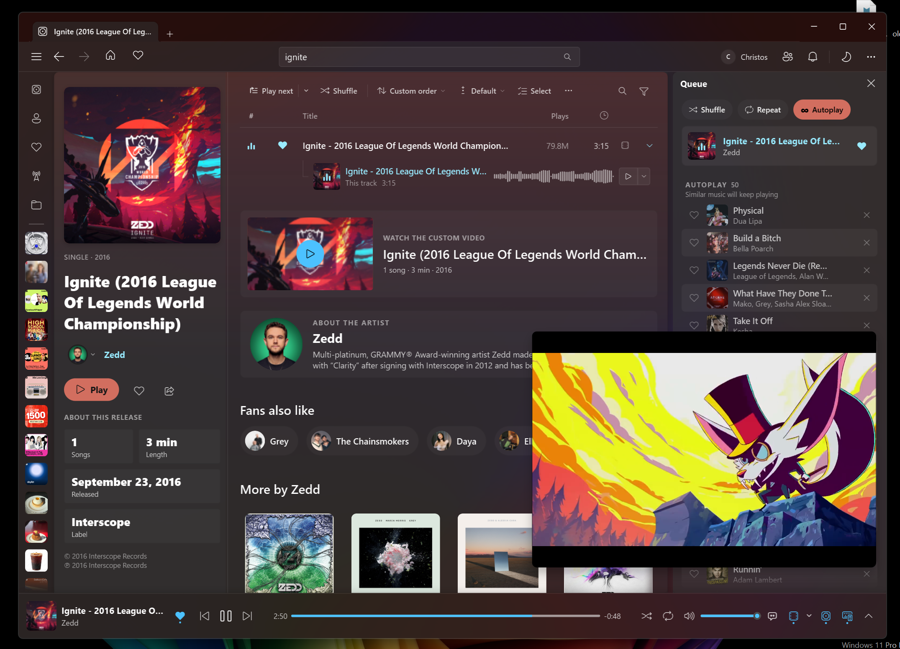
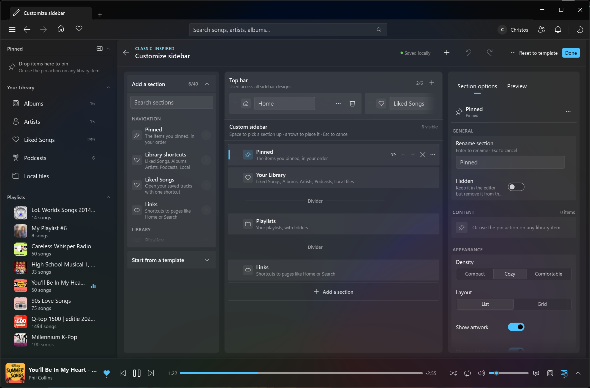
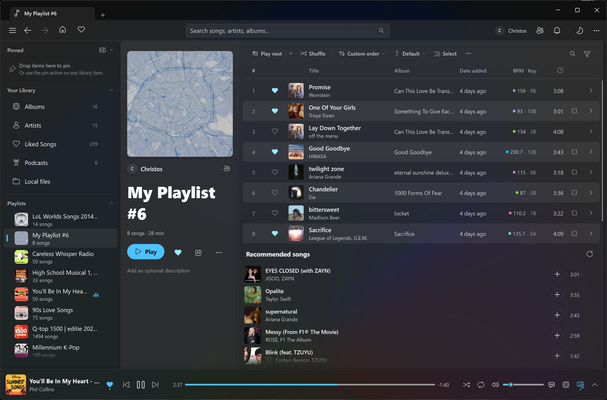
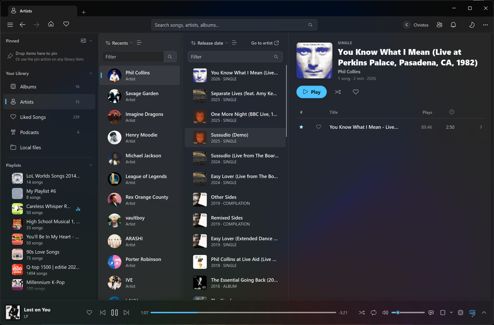
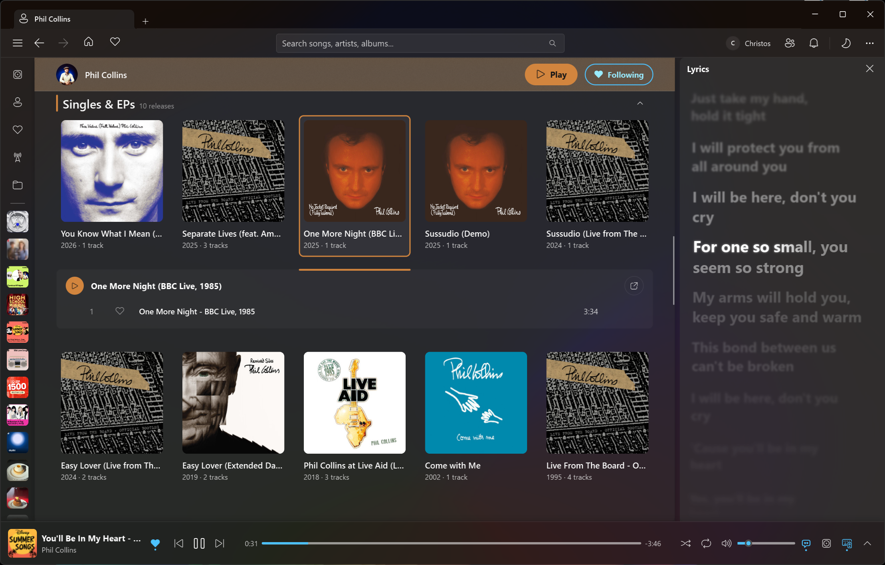
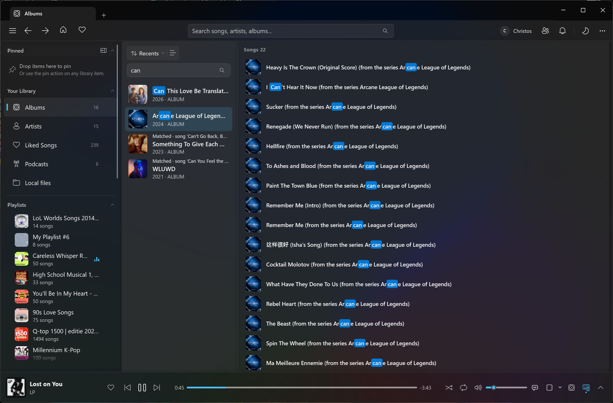
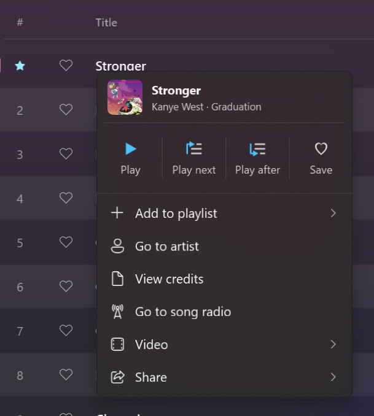

<p align="center">
  
</p>

<p align="center">
  <a href="https://github.com/christosk92/WaveeMusic/actions/workflows/release.yml"></a>
  <a href="https://github.com/christosk92/WaveeMusic/releases"></a>
  
  
  <a href="LICENSE"></a>
</p>

WaveeMusic is an open-source, Windows-native **Spotify desktop client** — a clean-room reimplementation of
Spotify's Access Point, Connect, Mercury, and metadata protocols, wrapped in a native app built on **.NET
10**. It works as a full playback client and as a Spotify Connect controller/target, with browser-style
tabs, synced lyrics, music videos, library sync, and opt-in on-device AI on Copilot+ PCs. A **Spotify
Premium** account is required.

> [!IMPORTANT]
> ### Wavee is being rebuilt on FluentGPU
> This WinUI 3 app is where Wavee began; its next chapter is **[FluentGPU](https://github.com/christosk92/fluent-gpu)**, a from-scratch, NativeAOT, GPU-rendered UI framework I'm building for .NET. The screenshots below are live captures of that rewrite — the download buttons still install the current WinUI app, which remains the shipping client until the FluentGPU build clears its install/update/reliability gates, targeting **August 2026**.
>
> **Why move off WinUI 3? We measured it.** A fair, matched benchmark — identical workloads, both frameworks as ARM64 NativeAOT, SHA-verified binaries, 620/620 runs, zero crashes. Navigating a real page (the thing a music client does all day): FluentGPU holds the full 120 Hz frame rate at **8.4 ms/frame**; WinUI 3 needs **16.7 ms — half the frame rate** — with a worst navigation of **463 ms vs 3.5 ms** and **25× less memory** under sustained use. Full data and every caveat, including where WinUI 3 still wins: [fluent-gpu/benchmarks/FrameworkComparison](https://github.com/christosk92/fluent-gpu/tree/main/benchmarks/FrameworkComparison).
>
> 

> [!WARNING]
> **This is alpha software.** Things will break, some features are rough or missing, and there's a real chance it won't launch on every machine — that's what an alpha is for. [Report anything that breaks](https://github.com/christosk92/WaveeMusic/issues).

## A look at Wavee on FluentGPU

<p align="center">
  
  <br />
  <sub>Immersive artist pages keep discovery, playback, and live lyrics in one view.</sub>
</p>

<table>
  <tr>
    <td width="50%"></td>
    <td width="50%"></td>
  </tr>
  <tr>
    <td><sub>Albums bring together credits, related music, queue management, and video.</sub></td>
    <td><sub>Your library is yours: arrange sections, choose a density, and pin what matters.</sub></td>
  </tr>
  <tr>
    <td width="50%"></td>
    <td width="50%"></td>
  </tr>
  <tr>
    <td><sub>Playlists expose useful details and recommendations without becoming cluttered.</sub></td>
    <td><sub>A multi-pane library makes large collections quick to scan and explore.</sub></td>
  </tr>
</table>

<details>
  <summary><strong>More screenshots</strong></summary>
  <br />
  <table>
    <tr>
      <td width="50%"></td>
      <td width="50%"></td>
    </tr>
    <tr>
      <td><sub>Explore a release inline without losing your place in an artist's discography.</sub></td>
      <td><sub>Search inside your collection and see exactly why each result matched.</sub></td>
    </tr>
  </table>
  <p align="center">
    
    <br />
    <sub>Rich track actions are available anywhere you find a song.</sub>
  </p>
</details>

## Highlights

- **Explore without losing your place** — browser-style tabs, an omnibar, pinned navigation, and inline discography expansion make deep browsing feel effortless.
- **Own your library** — search and sort collections, drill through artists and releases in multiple panes, customize the sidebar, and build detailed playlists.
- **Keep playback close** — synced lyrics, queue and autoplay controls, music videos, floating playback surfaces, and consistent track actions across the app.
- **Listen your way** — Spotify Connect controller and target support, device transfer, a 10-band EQ, normalization, crossfade, and an isolated audio process.
- **Feel at home on Windows** — adaptive color, light and dark themes, media-key integration, system media controls, tray support, and native x64/ARM64 packages.
- **Use AI only when you choose** — optional lyric explanations and song summaries run locally with Phi Silica on supported Copilot+ PCs.

The full feature catalog, including what's coming after the alpha, is in [ARCHITECTURE.md](ARCHITECTURE.md#full-feature-catalog). See [CHANGELOG.md](CHANGELOG.md) for release history.

## Install

Install the experimental channel with Windows App Installer. It checks for signed updates in the background and applies them after the app restarts.

<p align="left">
  <a href="https://github.com/christosk92/WaveeMusic/releases/download/experimental-latest/Wavee.Experimental.x64.appinstaller">
    <picture>
      <source media="(prefers-color-scheme: light)" srcset="./assets/DownloadInstaller-x64-dark.png" height="64" />
      </picture></a>
  &ensp;
  <a href="https://github.com/christosk92/WaveeMusic/releases/download/experimental-latest/Wavee.Experimental.arm64.appinstaller">
    <picture>
      <source media="(prefers-color-scheme: light)" srcset="./assets/DownloadInstaller-arm64-dark.png" height="64" />
      </picture></a>
</p>

Prefer a manual install? Download the matching `Wavee.UI.WinUI_<version>_<arch>.msix` from [GitHub Releases](https://github.com/christosk92/WaveeMusic/releases). The [alpha tester guide](ALPHA.md) covers requirements, updates, known limitations, privacy, and useful bug reports. **Windows 11 24H2 or later** and a **Spotify Premium** account are required.

## Build from source

These instructions build the current public **WinUI client**, not the separate FluentGPU rewrite.

```bash
git clone https://github.com/christosk92/WaveeMusic.git
cd WaveeMusic

dotnet run --project src/Wavee.UI.WinUI    # desktop client
dotnet run --project src/Wavee.Console     # terminal Connect client

dotnet build -c Release
dotnet test
```

`Wavee.UI.WinUI` builds `Wavee.AudioHost` automatically as an x64 subprocess (via the `BuildAudioHost`
MSBuild target) — this is normal even on ARM64 Windows, since the audio host loads `Spotify.dll`
(x86_64) for PlayPlay key derivation under built-in x64 emulation.

> [!NOTE]
> The public source tree excludes a small set of Spotify-property playback components, so it compiles and exposes the UI, metadata, library, Connect, video, and protocol layers, but a public-source build cannot decrypt Premium Ogg audio. See [what's not in this repo](ARCHITECTURE.md#whats-not-in-this-repo-proprietary) for details.

## Performance beyond the framework benchmark

The FluentGPU-vs-WinUI numbers above compare the two UI **frameworks** on matched synthetic workloads. A
second, paired campaign — running the actual **signed WaveeMusic packages**, both frameworks, same
machine, same day, same scripted content — is the next step toward the public FluentGPU release. Its
protocol, workloads, and publication rules are in [PERFORMANCE-BENCHMARKS.md](PERFORMANCE-BENCHMARKS.md).

## Contributing

Start with an [issue](https://github.com/christosk92/WaveeMusic/issues) describing what you'd like to
change. Pull requests target the active `release/<version>-<label>` branch; `master` and release branches
are protected from direct pushes. The [contributor and release guide](.agents/guides/contributing-and-releases.md)
covers the workflow; [ARCHITECTURE.md](ARCHITECTURE.md) covers the repository layout, agent
guides, and the technology stack.

## My first release

I started Wavee back in **2020**, originally for UWP — a playground to learn C# and XAML properly. I
never managed to publish it: Spotify kept deprecating the APIs I'd reverse-engineered, UWP faded out,
WinUI 3's rough early days made me lose faith more than once, and life moved on. The project sat in a
drawer for years.

What finally got it over the line was building alongside **Claude Code**, which let me untangle years of
half-finished ideas and actually push a release out the door. So here it is — a very, *very* experimental
first cut. Known rough edges in this alpha: memory usage under heavy navigation, general snappiness while
WinUI 3 allocation behavior is worked around, and the usual first-release surprises.

Thanks for taking a look. 🧡 Follow the FluentGPU migration and see what else I'm building at
[cproducts.dev](https://cproducts.dev).

## License

WaveeMusic is available under the [MIT License](LICENSE). It is an independent project and is not
affiliated with, endorsed by, or sponsored by Spotify. Spotify is a trademark of Spotify AB.
