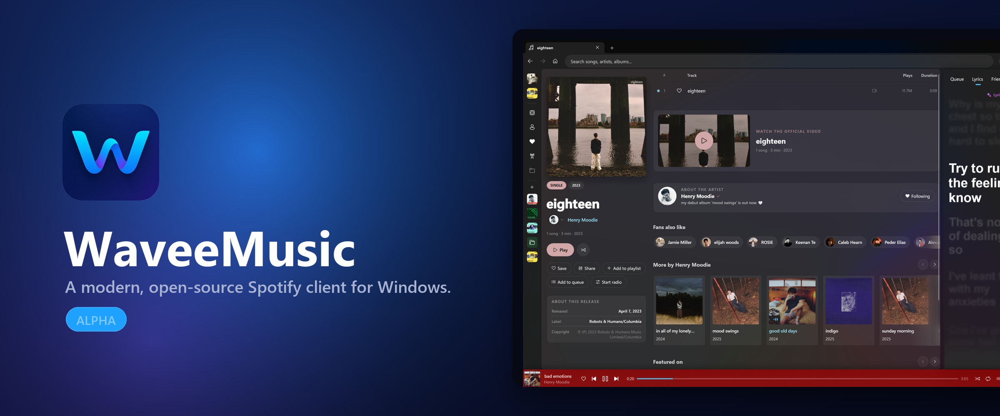
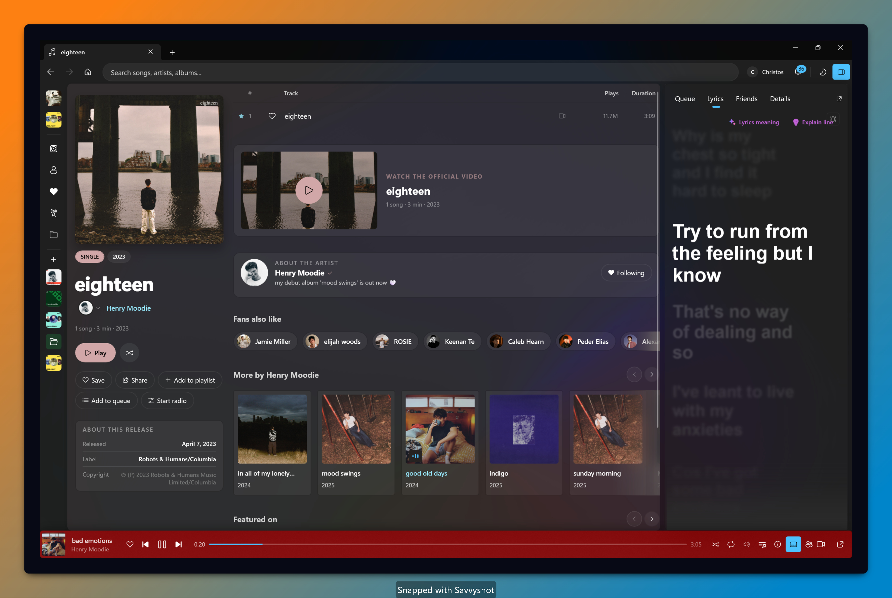
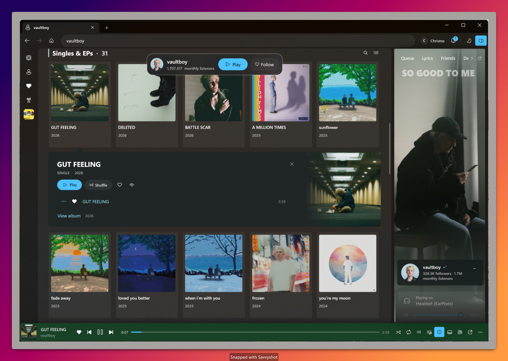
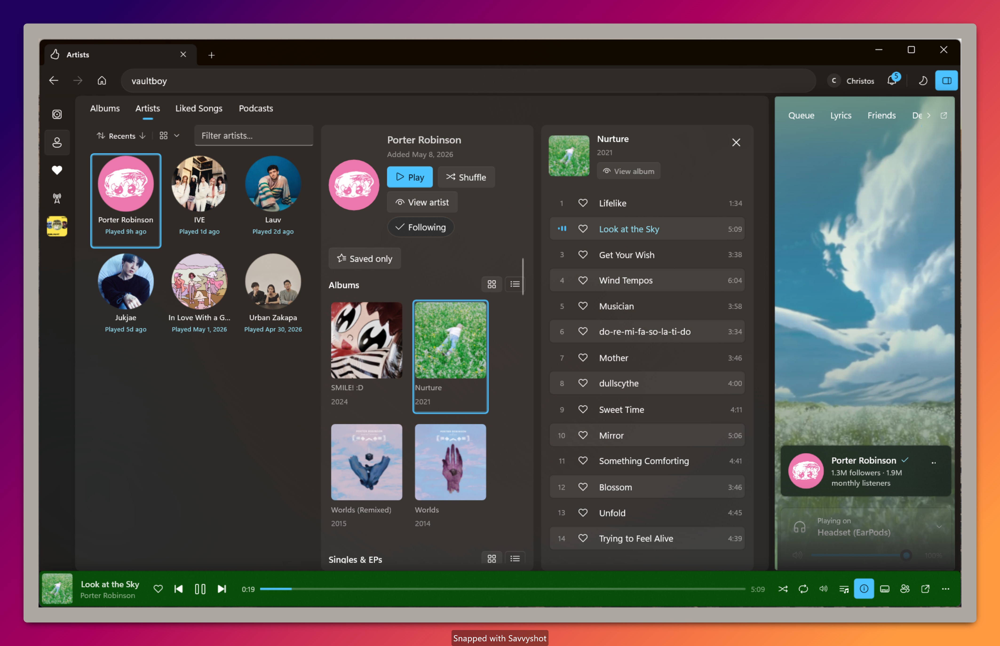
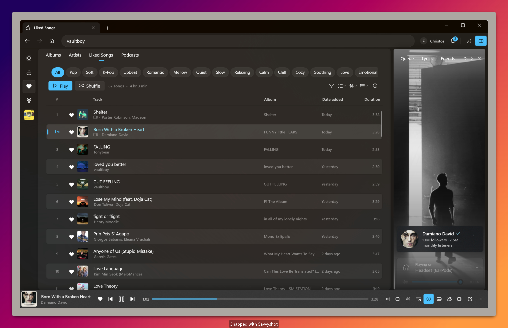
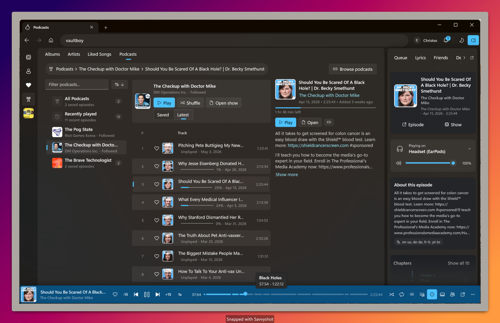
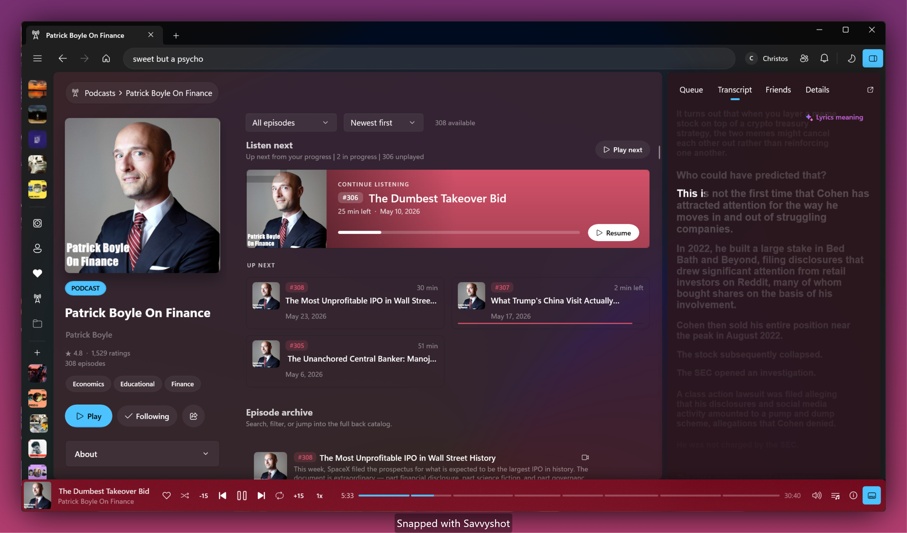
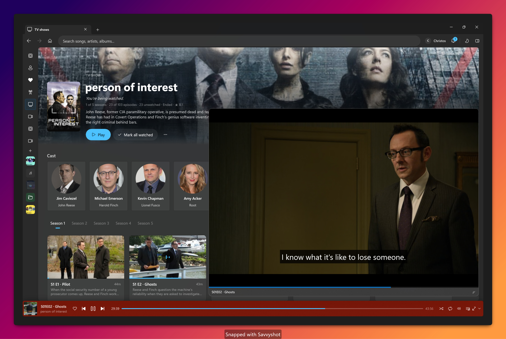

<p align="center">
  
</p>

<p align="center">
  <a style="text-decoration:none" href="https://github.com/christosk92/WaveeMusic/actions/workflows/release.yml">
    </a>
  <a style="text-decoration:none" href="https://github.com/christosk92/WaveeMusic/releases">
    </a>
  
  
  <a style="text-decoration:none" href="LICENSE">
    </a>
</p>

WaveeMusic is a modern, open-source **Spotify desktop client for Windows** — a clean‑room reimplementation of Spotify's Access Point, Connect (Dealer WebSocket), Mercury, and metadata (SpClient + Pathfinder) protocols, wrapped in a polished WinUI 3 app built on **.NET 10**. It works as both a full playback client and a Spotify Connect controller/target, with browser‑style tabs, synced lyrics, music videos, library sync, and opt‑in on‑device AI on Copilot+ PCs. A **Spotify Premium** account is required, and the app is intended for personal use.

> **Heads up — this is alpha software.** It's an early, experimental cut: things will break, some features are rough or missing, and there's a real chance it won't launch on every machine. That's what an alpha is for — if you hit something, a bug report is genuinely appreciated.

## Installing and running

WaveeMusic ships as a signed **MSIX** from GitHub Releases — there's no Microsoft Store listing yet. The button below installs the **experimental channel** through Windows App Installer and keeps it current with silent background auto‑updates.

<p align="left">
  <a style="text-decoration:none" href="https://github.com/christosk92/WaveeMusic/releases/download/experimental-latest/Wavee.Experimental.x64.appinstaller">
    <picture>
      <source media="(prefers-color-scheme: light)" srcset="./assets/DownloadInstaller-x64-dark.png" height="64" />
      </picture></a>
  &ensp;
  <a style="text-decoration:none" href="https://github.com/christosk92/WaveeMusic/releases/download/experimental-latest/Wavee.Experimental.arm64.appinstaller">
    <picture>
      <source media="(prefers-color-scheme: light)" srcset="./assets/DownloadInstaller-arm64-dark.png" height="64" />
      </picture></a>
</p>

Prefer a manual install? Grab the matching `Wavee.UI.WinUI_<version>_<arch>.msix` from [**GitHub Releases**](https://github.com/christosk92/WaveeMusic/releases). See [**ALPHA.md**](ALPHA.md) for system requirements, step‑by‑step installation, known limitations, and how to file a useful bug report.

> A Spotify **Premium** account is required. Wavee shows a non‑dismissible banner if you sign in with a Free account.

## Building from source

### Prerequisites
- **Windows 11 version 24H2 (build 26100)** or later — required to enable the on-device AI features.
- **.NET 10 SDK**
- A Spotify **Premium** account

```bash
# Clone
git clone https://github.com/christosk92/WaveeMusic.git
cd WaveeMusic

# Run the desktop client
dotnet run --project src/Wavee.UI.WinUI

# Run the console (Connect) client
dotnet run --project src/Wavee.Console

# Build everything / run tests
dotnet build -c Release
dotnet test
```

`Wavee.UI.WinUI` builds `Wavee.AudioHost` automatically as an x64 subprocess (via the `BuildAudioHost` MSBuild target). This is normal even on ARM64 Windows — the audio host loads `Spotify.dll` (x86_64) for PlayPlay key derivation, and the OS runs it under built-in x64 emulation. See [`src/Wavee.AudioHost/README.md`](src/Wavee.AudioHost/README.md) for the why.

## Contributing

Want to contribute? Let me know with an [issue](https://github.com/christosk92/WaveeMusic/issues) describing what you'd like to do before opening a [pull request](https://github.com/christosk92/WaveeMusic/pulls). The component guides in [`.agents/guides/`](.agents/guides) and the conventions in [`AGENTS.md`](AGENTS.md) / [`CLAUDE.md`](CLAUDE.md) are the fastest way to get oriented before touching a subsystem.

Releases follow a **release-train** flow — work PRs into the active `release/<x.y.z>-<label>` branch; `master` is protected and production. The full playbook lives in [`.agents/guides/contributing-and-releases.md`](.agents/guides/contributing-and-releases.md).

## Screenshots

<table>
  <tr>
    <td></td>
    <td></td>
  </tr>
  <tr>
    <td></td>
    <td></td>
  </tr>
  <tr>
    <td></td>
    <td></td>
  </tr>
  <tr>
    <td colspan="2"></td>
  </tr>
</table>

## 🎉 My first release

This is the first time I've ever actually *shipped* this thing — and it's been a long time coming.

I started Wavee back in **2020**, originally for **UWP**. It was my playground: a place to properly learn C# and XAML, to try every new technique I could get my hands on, and to see how far I could push a "real" app on my own. I never managed to publish it. Spotify kept deprecating the APIs I'd reverse-engineered, UWP slowly faded out, WinUI 3's rough early days made me lose faith more than once, and life moved on. The project sat in a drawer for years.

What finally got it over the line was **AI** — building alongside **Claude Code** let me untangle years of half-finished ideas and actually push a release out the door. So here it is: a very, *very* experimental first cut.

Thanks for taking a look. 🧡

### Known rough edges (this alpha)
- Memory usage / leaks under heavy navigation
- Waiting on WinUI 3 performance improvements (especially around allocations)
- General snappiness / responsiveness

## Features

### Desktop app
- **Home, Browse, Search, Library** — personalized shelves, browse categories, liked songs, saved artists, saved albums, playlists, shows, and episodes.
- **Artist, Album, Playlist, Show, Episode pages** — discography, top tracks, biography, related content, credits, queue actions, and color extraction from art.
- **Browser-style tabs** with pin / drag-and-drop / context menus, a sidebar with rich navigation, and an omnibar for search, suggestions, and fast navigation.
- **Music videos** — Spotify music videos play through WebView2 EME with selectable quality and dedicated video controls.
- **Lyrics** — synced lyrics with shader effects, multi‑language detection, and CJK romanization (pinyin / kana).
- **Now-playing surfaces** — compact player bar, expandable right-panel player, mini video player, full video page, and floating player window share the same playback surface.
- **Friends feed**, **profile**, **concerts**, in‑app **settings** (theme, audio device, EQ, language, storage/network, diagnostics).
- **On-device AI on Copilot+ PCs** (opt-in) — explain a lyric line or summarize a song's themes with Phi Silica running locally on the NPU. Nothing leaves the machine; off by default.

### Coming soon after the initial alpha release
- **Local media library** — index audio, music videos, movies, TV shows, episodes, subtitles, and embedded tracks from disk; browse them alongside Spotify content.
- **Local metadata enrichment** — TMDB for movies / TV, MusicBrainz + Cover Art Archive for music, local artwork caching, thumbnails, watched state, resume position, custom collections, and local likes.
- **Spotify linking for local media** — link local music videos to Spotify tracks so playback, metadata, queue state, and now-playing identity stay connected.
- This code is present behind the `WAVEE_ENABLE_LOCAL_FILES` feature flag for internal testing, but it is disabled in the initial alpha release.

### Spotify Connect
- Full Dealer WebSocket implementation, real‑time cluster state synchronization.
- Device picker for transferring playback between devices.
- Volume sync, queue updates, queue edits, remote command handling — works as both controller and target.
- This-device playback state is mirrored back into Connect so Spotify queue, device state, Recently Played, and UI surfaces stay in sync.

### Audio
- Audio runs in a separate process (`Wavee.AudioHost`) over named‑pipe IPC, so audio engine crashes don't take the UI down.
- BASS for decode + DSP, NVorbis for Ogg Vorbis, and PortAudio for cross‑arch output.
- Fast seek with byte-position bisection, predictive range prefetch, and decoder recreation fallback.
- Lazy progressive CDN streaming, head-file caching, audio key resolution, queue prefetch, and gapless / crossfade preparation.
- 10‑band equalizer, normalization (loudness), compressor / limiter stages, volume control, and crossfade between tracks.

### Diagnostics and tooling
- Debug page for IPC health, audio process state, Connect-state capture, in-memory logs, memory pressure, and UI operation timing.
- Settings sections for diagnostics logging, Connect updates, cache/storage, network behavior, playback, audio output, and on-device AI readiness.
- Component agent guides in `.agents/guides/` for playback, Connect state, library sync, and track / episode UI maintenance.

### Authentication
- OAuth 2.0 — both **Authorization Code with PKCE** (browser flow) and **Device Code** flow.
- Credentials cached encrypted on disk via Windows DPAPI, so you only sign in once.

### Architecture highlights
- **.NET 10** with Native AOT compatibility on the core library and console.
- **MVVM + DI** in the desktop app (`Microsoft.Extensions.DependencyInjection`, `CommunityToolkit.Mvvm`, `ReactiveUI`).
- **Single-project MSIX** packaging for x86 / x64 / ARM64.

## Repository structure

The solution is composed of nine first-party `src/` projects, four test suites under `test/`, and two vendored libraries under `vendor/`. Each project owns a focused concern and has its own README with developer-facing details. The summaries below are derived from those READMEs and from the code's own structure (you can browse the full interactive map by running `/understand-anything:understand-dashboard`).

```
WaveeMusic/
├── src/Wavee/                      Core protocol library (auth, Connect, audio orchestration, metadata)
├── src/Wavee.UI/                   Framework-neutral UI service layer (no XAML)
├── src/Wavee.UI.WinUI/             WinUI 3 desktop app (the headline client)
├── src/Wavee.Local/                Local media library (scan, classify, enrich, query, playback helpers)
├── src/Wavee.Controls.Lyrics/      Lyrics rendering library (D2D shaders, language detect, romanization)
├── src/Wavee.AudioHost/            Out-of-process audio runtime (BASS + NVorbis + PortAudio, x64-only)
├── src/Wavee.Playback.Contracts/   Shared IPC contracts between WinUI app and AudioHost
├── src/Wavee.Console/              AOT-compiled CLI client (Spectre.Console + Docker-friendly)
├── test/Wavee.Tests/               Core protocol library tests (xUnit v3 + librespot-verified crypto vectors)
├── test/Wavee.UI.Tests/            UI service layer tests (no WinUI)
├── test/Wavee.Local.Tests/         Local media classification / URI / subtitle tests
├── test/Wavee.PlayPlay.Tests/      PlayPlay decryption tests (x64 plain-Exe harness, not xUnit)
├── vendor/Lyricify.Lyrics.Helper/  Vendored: multi-provider lyrics search (QQ, Kugou, Netease, Apple, Musixmatch)
├── vendor/NVorbis/                 Vendored: managed Ogg Vorbis decoder
├── signing/                        Azure Artifact Signing scripts + LAF token coupling notes
└── Wavee.slnx                      Solution
```

### `src/Wavee` — core protocol library
[`README`](src/Wavee/README.md)

Clean-room reimplementation of every protocol the Spotify desktop client speaks: AP (TCP+TLS with Diffie-Hellman + Shannon stream cipher), **Mercury** (legacy request/response over the AP), **Dealer** (WebSocket bus for Connect cluster state / transfer / volume / remote commands), **SpClient** (protobuf-over-HTTPS metadata API), **Pathfinder** (GraphQL for search / browse / home / profile), **Login5** (OAuth backend), **AudioKey** (AES-128 key fetch for Ogg decryption), and the **gabo telemetry envelope**. AOT-compatible — every IL2xxx / IL3xxx warning is treated as an error. No UI. Heavy `System.Reactive` usage; most state is `IObservable<T>`. The `Session` type is the anchor of everything: it connects to an AP, authenticates, and lazily initializes Dealer / Mercury / Pathfinder / AudioKeyManager / EventService on first access — so a process that only needs metadata never opens a Dealer WebSocket. See also [`Connect/DEALER_PROTOCOL.md`](src/Wavee/Connect/DEALER_PROTOCOL.md), [`Connect/DEALER_IMPLEMENTATION_GUIDE.md`](src/Wavee/Connect/DEALER_IMPLEMENTATION_GUIDE.md), [`OAuth/OAUTH_FLOWS.md`](src/Wavee/OAuth/OAUTH_FLOWS.md), and [`Core/Crypto/README.md`](src/Wavee/Core/Crypto/README.md).

### `src/Wavee.UI` — framework-neutral UI service layer
[`README`](src/Wavee.UI/README.md)

Plain C# class library that sits between `Wavee` (protocol) and `Wavee.UI.WinUI` (XAML). No XAML, no WinUI dependency — just contracts (`IPlaybackService`, `IPlaybackStateService`, `IUiDispatcher`, …), enums (`RepeatMode`, …), models (`ArtistCredit`, `QueueItem`, `PlaybackContextInfo`, …), and services that need to be testable in plain xUnit without booting WinUI. If a future `Wavee.UI.Avalonia` ever appeared, this project would stay unchanged.

### `src/Wavee.UI.WinUI` — desktop client
[`README`](src/Wavee.UI.WinUI/README.md)

The headline app. WinUI 3 / Windows App SDK 2.0, **single-project MSIX**, x86 / x64 / ARM64. Composition flow on launch:

```
App.OnLaunched
  → AppLifecycleHelper.ConfigureHost()       builds IHost
  → Ioc.Default.ConfigureServices(...)       wires CommunityToolkit MVVM Ioc to the same container
  → Force-resolve IMetadataDatabase          runs schema migrations before first paint
  → MainWindow.Instance.Activate()           user sees the window
  → MainWindow.Instance.InitializeApplicationAsync()   deferred login state, library sync, …
```

Crash handlers are wired at three levels (XAML, AppDomain, unobserved-task scheduler) and funnel through `LogUnhandledException` → `PiiRedactor` → `AppPaths.CrashLogPath`. Notable pages include `HomePage`, `SearchPage`, `ArtistPage`, `AlbumPage`, `PlaylistPage`, `LikedSongsView`, `ArtistsLibraryView`, `AlbumsLibraryView`, `LocalLibraryPage`, `VideoPlayerPage`, `ProfilePage`, `SettingsPage`, `ConcertPage`, `DebugPage`, and the `ShellPage` shell. Reusable controls include `PlayerBar`, `SidebarPlayer`, `ExpandedNowPlayingLayout`, `TrackItem`, `TrackDataGrid`, `ContentCard`, `LibraryGridView`, `ExpandableAlbumGrid`, `SectionShelf`, `HeroHeader`, `Omnibar`, `Sidebar`, `QueueTabView`, `RightPanelView`, `SpotifyConnectDialog`. Three custom MSBuild targets matter:

- **`BuildAudioHost`** — spawns an isolated `dotnet build` subprocess for `Wavee.AudioHost` with `Platform=x64` on every WinUI build. Necessary because a project reference would inherit the parent's project-evaluation cache and could land an ARM64 NVorbis.dll next to an x64-only AudioHost.
- **`RemoveDuplicateReferencedProjectAssets`** — removes WinUI's duplicate `<Content>` copies (~2.4 MB just for `Core14.profile.xml`). Carefully scoped — don't widen to the full `Wavee.Controls.Lyrics/` folder, which also contains compiled per-assembly XAML (`.xbf`).
- **`StripUnusedWindowsAiPayload` + AI workaround targets** — keeps only the Phi Silica payload (Microsoft.Windows.AI + ML + onnxruntime + DirectML), strips Image / Generative / ContentModeration projections, and works around a WinAppSDK 2.0.1 regression where managed AI projection assemblies don't deploy into AppX. Delete these workaround targets when the WinAppSDK / MSIX tooling fix lands.

The on-device AI surface (Copilot+ PCs only, opt-in by default, region-gated) sits in `Services/AiCapabilities.cs` as a single composite gate (hardware + region + opt-in) that every AI affordance binds against.

### `src/Wavee.AudioHost` — out-of-process audio runtime
[`README`](src/Wavee.AudioHost/README.md)

Separate `Exe` process, x64-only (because `Spotify.dll` is x86_64-native and must be loaded in-process for PlayPlay key derivation). AOT-compatible. Audio stack: **ManagedBass** (decoder + mixer + DSP — EQ, normalization, crossfade), **NVorbis** (managed Ogg Vorbis decoder, vendored), **PortAudioSharp2** (cross-platform output), **z440.atl.core** (metadata). On first run, `NativeDeps/` downloads the missing native binaries (`portaudio.dll` for ARM64, `bass.dll` for x64) into the runtime directory; failure exits with code 3 so the UI can distinguish first-run setup failure from a transient crash. Talks to the WinUI process over a named pipe with length-prefixed JSON. AudioHost has **zero project references on Wavee\* assemblies** — the IPC contracts come in via `<Compile Include>`, eliminating a stale-DLL bug class.

### `src/Wavee.Playback.Contracts` — IPC contracts
[`README`](src/Wavee.Playback.Contracts/README.md)

Tiny library (~3 files) defining the wire protocol between WinUI and AudioHost: `IpcMessage` envelope, command/event DTOs, `IpcPipeTransport` (length-prefixed JSON over named pipe — `[4 bytes big-endian length][UTF-8 JSON payload]`), and `AudioFileCache`. Consumed two different ways: **as a project reference** by `Wavee` (and transitively by `Wavee.UI.WinUI`), and **as source-included** (`<Compile Include>`) by `Wavee.AudioHost`. Wire format is JSON so type identity across assemblies doesn't matter. To add a new command/event, edit `IpcMessages.cs` only — both sides pick it up automatically.

### `src/Wavee.Controls.Lyrics` — synced lyrics rendering library
[`README`](src/Wavee.Controls.Lyrics/README.md)

WinUI 3 control library for time-synchronized lyrics with shader effects. Tech stack: `Microsoft.Graphics.Win2D` for canvas + effects, `ComputeSharp.D2D1.WinUI` for AOT-friendly D2D pixel/compute shaders, `SpoutDx.Net.Interop` for cross-process texture sharing, `NAudio.Wasapi` for audio I/O during preview, `Vortice.Direct3D11` for DirectX interop, `NTextCat` + `Core14.profile.xml` (~2.4 MB bundled) for 14-language identification, `csharp-pinyin` and `WanaKana-net` for CJK romanization. Hosts an `EnsureIntermediateControlXaml` MSBuild target that copies a few `.xaml` files into `IntermediateOutputPath` before output to work around a WinUI cross-project loose-file XAML resolution quirk.

### `src/Wavee.Local` — local media library
[`README`](src/Wavee.Local/README.md)

Framework-neutral, AOT-compatible, **no dependency on `Wavee.dll` or any UI**. Owns scan / classify / index / enrich / query / edit for `wavee:local:{kind}:{hash}` URIs. Scope: watched-folder management, filesystem scanning + metadata extraction (ATL.Net), content classification into Music / MusicVideo / TvEpisode / Movie / Other, TV-series + season auto-grouping from filenames, subtitle discovery (sibling files + RARBG-style `Subs/` folders), embedded audio/subtitle/video stream indexing, online metadata enrichment (TMDB for movies/TV, MusicBrainz + Cover Art Archive for music), local lyrics (sibling `.lrc` + LrcLib fetch), user collections, per-item kind / metadata overrides as JSON sidecars, watched state + resume position, and liked local tracks. Does NOT own its own SQLite database — writes to the shared `Wavee.Core.Storage.MetadataDatabase` (`Wavee.dll`) via SQL string constants declared in `Schema/LocalSchemaV17.cs`+ and imported by the v17 migration.

### `src/Wavee.Console` — AOT CLI client
[`README`](src/Wavee.Console/README.md)

Terminal Spotify Connect client built on the same `Wavee` core. Useful for headless control, smoke-testing the protocol layer, and reproducing Connect bugs without the UI. `OutputType=Exe`, **Native AOT** (`PublishAot=true`), Linux-friendly (`DockerDefaultTargetOS=Linux`, ships a `Dockerfile`). `Program.cs` configures Serilog through a `SpectreUI` sink, sets up `IHttpClientFactory` + DPAPI-backed `CredentialsCache`, runs OAuth (Authorization Code + PKCE) if no stored credentials, and hands off to `ConnectConsole.cs` for the interactive REPL (cluster state, queue inspection, play/pause/seek/next/prev/volume/transfer, device picker).

### `test/Wavee.Tests` — core library tests
[`README`](test/Wavee.Tests/README.md)

xUnit v3 + FluentAssertions + Moq (with `DynamicProxyGenAssembly2` granted `InternalsVisibleTo`). Covers the `Wavee` core protocol library. **Crypto primitives are validated against librespot** — see [`test/Wavee.Tests/Core/Crypto/README.md`](test/Wavee.Tests/Core/Crypto/README.md) for the validation methodology and instructions for regenerating test vectors from librespot's Rust source (`ShannonCipher`: 28 tests against librespot vectors; `AudioDecryptStream`: 9 tests). PlayPlay tests live in their own project because they need an x64-only process — don't add PlayPlay tests here.

### `test/Wavee.UI.Tests` — UI service-layer tests
[`README`](test/Wavee.UI.Tests/README.md)

xUnit v3 suite for `Wavee.UI`. Doesn't reference `Wavee.UI.WinUI` deliberately — that would drag MSIX / packaging / RID complexity into the test build. `Wavee.UI` declares `InternalsVisibleTo` for this project, so tests exercise `internal` types directly.

### `test/Wavee.PlayPlay.Tests` — PlayPlay decryption tests
[`README`](test/Wavee.PlayPlay.Tests/README.md)

x64-only plain `Exe` harness (not xUnit) that loads `Spotify.dll` to exercise the PlayPlay key emulator end-to-end. Forced to x64 because the loader is in-process. Public clones get a stub `Program.cs` (the real test vectors bundle Spotify property) so the project still builds. Exits non-zero on failure.

### `test/Wavee.Local.Tests`

Tests for `Wavee.Local`'s classifier, filename parser, URI helpers, and subtitle discovery.

### `vendor/Lyricify.Lyrics.Helper`
[`README`](vendor/Lyricify.Lyrics.Helper/README.md)

Multi-provider lyrics search + parsing — supports Lyricify Syllable / Lines, LRC, QRC, KRC, YRC, TTML, raw Spotify and Musixmatch JSON, plus search providers for QQ Music, NetEase, Kugou, SodaMusic, Apple Music, and Musixmatch. Consumed via project reference from `Wavee.Controls.Lyrics`.

### `vendor/NVorbis`
[`README`](vendor/NVorbis/README.md)

Pure-managed Ogg Vorbis decoder. No P/Invoke, no unsafe code. Used by `Wavee.AudioHost` to decode Ogg Vorbis streams alongside ManagedBass.

### `signing/`
[`README`](signing/README.md)

Azure Artifact Signing (formerly Trusted Signing) scripts for release MSIX builds. `Sign-Release.ps1` is the one-command pipeline that swaps the manifest publisher to the release identity, builds + signs + verifies + installs, then restores the dev publisher via try/finally (even on Ctrl-C). The same flow runs in CI via `.github/workflows/release.yml`. **Important LAF coupling note:** the Phi Silica LAF token in `Wavee.UI.WinUI/Services/AiCapabilities.cs` is cryptographically bound to the **publisher hash** of the manifest's `Identity.Publisher`, so release-signed builds need a second LAF token issued against the production PFN — see `signing/laf-second-request.md` for the email draft.

## Agent guides

`.agents/guides/` contains component-specific, LLM-friendly guides for the most cross-cutting subsystems. Read the relevant guide before touching that area:

| Guide | Scope |
|---|---|
| `track-and-episode-ui.md` | Every track/episode row, list, card, search, queue, now-playing surface. |
| `connect-state.md` | Spotify Connect: dealer WebSocket, this-device announce, cluster state, remote commands, device picker / volume / now-playing UI. |
| `library-and-sync.md` | User library lifecycle: collection sync, playlist cache, dealer-driven incremental updates, save / pin / follow write paths, library UI. |
| `playback.md` | Playback runtime: orchestrator, queue + context, track resolution, AudioHost IPC, decode / decrypt / DSP / EQ, prefetch, local-file playback, video playback. |
| `queue.md` | Queue subsystem: `PlaybackQueue` three buckets, cursor + shuffle + repeat, autoplay rollover, cluster sync, drag-drop, context-menu Play next / Add to queue. |
| `composition-image.md` | `CompositionImage`: GPU-resident image primitive, cache lifecycle, LoadedImageSurface, suspension gate, retry behaviors. |
| `content-card.md` | `ContentCard`: reusable shelf / grid card across Home / Search / Browse / Library / Artist / Album / Show / Concert / Profile / Local-media. |
| `discography-expander.md` | Artist-page inline album expander: `ExpandableAlbumGrid`, `ExpandingGridLayout`, `AlbumDetailPanel` overlay. |

Conventions and the index live in `AGENTS.md` (single source of truth) and `CLAUDE.md` (Claude Code instructions). A machine-readable knowledge graph of the whole codebase is at `.understand-anything/knowledge-graph.json` — open it with `/understand-anything:understand-dashboard` for an interactive map.

## Technology stack

| Component       | Technology                                                                 |
|-----------------|----------------------------------------------------------------------------|
| **Framework**   | .NET 10, C# preview                                                        |
| **UI**          | WinUI 3, Windows App SDK 2.0, CommunityToolkit, ReactiveUI                 |
| **Audio**       | BASS (DSP), NVorbis (Ogg), PortAudio (output) — out-of-process             |
| **Video**       | WebView2 EME, Windows Media Playback, Media Foundation                     |
| **Protocols**   | Protocol Buffers (Google.Protobuf), WebSocket, Mercury, ZStandard, Shannon |
| **Reactive**    | System.Reactive (Rx.NET)                                                   |
| **MVVM / DI**   | CommunityToolkit.Mvvm, Microsoft.Extensions.DependencyInjection / Hosting  |
| **Storage**     | SQLite (Microsoft.Data.Sqlite) for library / playlist cache                |
| **Logging**     | Serilog                                                                    |
| **Lyrics**      | ComputeSharp.D2D1.WinUI, NTextCat, csharp-pinyin, WanaKana                 |
| **On-device AI**| Phi Silica via `Microsoft.Windows.AI.Text` (Copilot+ PC only, opt-in)      |
| **Signing**     | Azure Artifact Signing (release MSIX), self-signed cert for dev            |

## Gabo events (telemetry)

Wavee posts the bare minimum set of playback events Spotify's backend needs to credit your plays toward Recently Played, play counts, and the "made for you" recommendations you already get from any official client. Everything goes to `https://spclient.wg.spotify.com/gabo-receiver-service/v3/events/`.

The legacy `event-service/v1/events` path (both Mercury and HTTPS variants) returns 404 — gabo is the only working transport, and our event surface is built around it.

### Events sent — playback only

| Event | When | What |
|---|---|---|
| `RawCoreStream` | At the end of each track | Track URI, context URI, ms played, reason started/ended, audio format. **This is the play-history event** — Recently Played and play counts both come from here. |
| `RawCoreStreamSegment` | Per pause/resume/seek split inside a track | Same playback id + segment ms range |
| `AudioSessionEvent` | When playback opens/seeks/closes | Session lifecycle markers |
| `BoomboxPlaybackSession` | Once per track | Buffering / resolve / setup latencies + duration |
| `Download`, `HeadFileDownload` | Per CDN fetch | File id, bytes, latency |
| `CorePlaybackCommandCorrelation` | When a play command runs | Maps command id → playback id |
| `ContentIntegrity` | Per track | Playback id + a flag stating we played in real-time (not ripping) |

### Events Wavee deliberately does NOT send

The desktop client sends these; we don't because none of them are required to make Recently Played work:

- **Ad pipeline** — `AdEvent`, `AdRequestEvent`, `AdOpportunityEvent`, `AdSlotEvent`. Premium-only client, no ads.
- **UI interaction telemetry** — `DesktopUIShellInteractionNonAuth`, `WindowSizeNonAuth`.
- **System / driver fingerprinting** — `AudioDriverInfo`, `WasapiAudioDriverInfo`, `ModuleDebug`, `ConfigurationFetched`, `TimeMeasurement`, `ClientRuntimeDiag`.
- **Library / cache reports** — `LocalFilesReport`, `CacheReport`, `OfflinePruneReport`, `CollectionEndpointUsage`.
- Anything else from the 100+ event types defined in Spotify's binary.

### How it's wired

| File | Role |
|---|---|
| `src/Wavee/Connect/Events/EventService.cs` | Posts each `IPlaybackEvent` (one envelope per POST in v1; client-side batching can be layered later). Exposes `IObservable<IPlaybackEvent>` so in-process subscribers can mirror what's sent. |
| `src/Wavee/Connect/Events/GaboEnvelopeFactory.cs` | Builds the protobuf envelope. The per-event payload is one `EventFragment`; the rest of the fragments are the **context block** — client id, installation id, application/device descriptors, time, SDK. |
| `src/Wavee/Connect/Events/IPlaybackEvent.cs` | Interface for one event type. Implementations: `RawCoreStreamPlaybackEvent`, `RawCoreStreamSegmentPlaybackEvent`, `AudioSessionPlaybackEvent`, `BoomboxPlaybackSessionEvent`, `DownloadPlaybackEvent`, `HeadFileDownloadPlaybackEvent`, `CorePlaybackCommandCorrelationEvent`, `ContentIntegrityPlaybackEvent`. |
| `src/Wavee/Core/Http/SpClient.cs` (`PostGaboEventAsync`) | The actual HTTPS POST. |

### Mimicry of the desktop client (anti-fraud avoidance)

Spotify's anti-fraud pipeline drops batches whose context block doesn't look like a first-party client. To stay below that bar, the envelope's `context_sdk` fragment uses the same `sdk_version_name` and `sdk_type` strings the C++ desktop client emits, the `application_desktop` fragment carries the desktop client's app version (`1.2.88.483` / version code `128800483`), and the device-context fragments use the real machine's BIOS manufacturer/model + OS version + Windows machine SID. The breakthrough is documented inline in `GaboEnvelopeFactory.cs`. If you change the SDK strings or version code, expect Recently Played to silently stop working.

## What's NOT in this repo (proprietary)

Three Spotify-property files are deliberately excluded from the public source tree. The build still compiles without them — stubs are provided where needed — but a few features are degraded or disabled.

| Excluded file | What it does | Effect of the stub |
|---|---|---|
| `src/Wavee/Core/Crypto/AudioDecryptStream.cs` | AES-128-CTR Big-Endian decryption for Spotify audio files (matches librespot's `audio/src/decrypt.rs`). Provides streaming decrypt with arbitrary seeking. | The file is excluded entirely (no stub). Test fixtures (`test/Wavee.Tests/Core/Crypto/…`) document what *would* be tested. Without it, you cannot decrypt encrypted Spotify Ogg streams in this repo's open form. |
| `src/Wavee/Core/Audio/PlayPlayConstants.cs` | Spotify-specific constants used to derive PlayPlay AES keys directly from `Spotify.dll`, used as a fallback when the AP audio-key channel returns a permanent error. | `PlayPlayConstants.Stub.cs` ships in its place; the runtime feature stays disabled. `AudioKeyManager` falls back to AP-only key resolution. |
| `src/Wavee.AudioHost/PlayPlay/PlayPlayKeyEmulator.cs` | The actual emulator that loads `Spotify.dll` (x86_64) in-process and exercises PlayPlay. | `PlayPlayKeyEmulator.Stub.cs` ships in its place. `Wavee.PlayPlay.Tests` runs against the stub and skips the real test vectors. |

**Why excluded:** these files reproduce Spotify's DRM (the AES decryption stream) and proprietary key-derivation data (PlayPlay constants embedded in `Spotify.dll`). Both are part of Spotify's intellectual property; we're not in a position to redistribute them. The connection-protocol layer (handshake, Shannon cipher, packet framing) is fully open and included — see [Wavee/Core/Crypto/README.md](src/Wavee/Core/Crypto/README.md) for the legal note.

**What still works without them:** authentication, session management, Spotify Connect (full controller + target), all metadata APIs (SpClient + Pathfinder), the WinUI app's UI, Spotify library sync, search, lyrics, Spotify music videos, Connect command issuance, telemetry, and the feature-flagged local media code paths when enabled — everything except the actual decryption of Spotify-encrypted audio files. If you need to play encrypted streams, you'll need to implement audio decryption yourself or obtain proper licensing.

## License

MIT — see [LICENSE](LICENSE).
