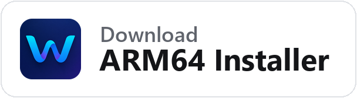

<p align="center">
  
</p>

<p align="center">
  <a href="https://github.com/christosk92/WaveeMusic/actions/workflows/release.yml"></a>
  <a href="https://github.com/christosk92/WaveeMusic/releases"></a>
  
  
  <a href="LICENSE"></a>
</p>

> [!IMPORTANT]
> ### Wavee is being rebuilt on FluentGPU
> WaveeMusic is actively migrating off WinUI 3 and onto **[FluentGPU](https://github.com/christosk92/fluent-gpu)**, a from-scratch, NativeAOT, GPU-rendered UI framework for .NET. **The screenshots below are live captures of that in-development rewrite; the download buttons still install the current WinUI app.**
>
> The first public, signed FluentGPU experimental MSIX is targeting **August 2026**. That is a target window, not a fixed release date—the build will ship when installation, updates, authentication, playback, Connect, and reliability gates pass.
>
> **Why move off WinUI 3?** We benchmarked both frameworks head-to-head — identical pixel-parity workloads, both as ARM64 NativeAOT, SHA-verified binaries, 620/620 runs with zero crashes. Navigating a realistic page (hero + card grid + track list, built fresh per navigation, the thing a music client does all day): FluentGPU holds the full 120 Hz frame rate at **8.4 ms** per frame while WinUI 3 needs **16.7 ms** — two vblanks, i.e. **half the frame rate** — with a worst navigation of **463 ms vs 3.5 ms** and **25× less memory** under sustained navigation. Adding 225 styled controls to a window costs FluentGPU **0.47 ms** where WinUI 3 pays **91 ms**. Full data, methodology, and the caveats that keep it honest (including where WinUI 3 wins): [fluent-gpu/benchmarks/FrameworkComparison](https://github.com/christosk92/fluent-gpu/tree/main/benchmarks/FrameworkComparison).
>
> 

WaveeMusic is an experimental, Windows-native Spotify client. It brings Spotify's catalog and Connect ecosystem into a desktop experience designed around how people actually browse, queue, and organize music. The protocol, playback, library, and service layers continue across the migration; FluentGPU replaces the WinUI interface around them.

> [!WARNING]
> The current WinUI release is early alpha software. It requires **Windows 11 24H2 or later** and a **Spotify Premium** account. Expect rough edges, and please [report anything that breaks](https://github.com/christosk92/WaveeMusic/issues).

## Install

Install the experimental channel with Windows App Installer. It checks for signed updates in the background and applies them after the app restarts.

<p>
  <a href="https://github.com/christosk92/WaveeMusic/releases/download/experimental-latest/Wavee.Experimental.x64.appinstaller">
    <picture>
      <source media="(prefers-color-scheme: light)" srcset="./docs/public/media/readme/DownloadInstaller-x64-dark.png" />
      
    </picture>
  </a>
  &ensp;
  <a href="https://github.com/christosk92/WaveeMusic/releases/download/experimental-latest/Wavee.Experimental.arm64.appinstaller">
    <picture>
      <source media="(prefers-color-scheme: light)" srcset="./docs/public/media/readme/DownloadInstaller-arm64-dark.png" />
      
    </picture>
  </a>
</p>

Prefer a manual install? Download the matching MSIX from [GitHub Releases](https://github.com/christosk92/WaveeMusic/releases). The [alpha tester guide](ALPHA.md) covers requirements, updates, known limitations, privacy, and useful bug reports.

## The FluentGPU rewrite

FluentGPU keeps the component model that makes modern UI productive—immutable element records, components, and React-style hooks—but replaces the C++ XAML and Composition core with a signals-first GPU paint path. It is being built for the parts of Wavee that stress a conventional UI toolkit: media-rich pages, fluid animation, persistent playback surfaces, and virtualized libraries with thousands of tracks.

The rewrite is a working application, not a design mockup. Authentication, the live Spotify catalog, library, playback, Connect, lyrics, video surfaces, settings, and the main detail pages already run on the new engine. The remaining work is about feature parity, packaging, updates, and sustained reliability—not just making the screenshots look finished.

Until those gates pass, the WinUI MSIX remains the downloadable WaveeMusic app. Follow [FluentGPU on GitHub](https://github.com/christosk92/fluent-gpu) or see what else is being built at [cproducts.dev](https://cproducts.dev).

### Performance outlook

This is the honest snapshot before the matched WinUI 3 vs FluentGPU campaign. **Measured** values come from the current ARM64 developer build or Microsoft; **estimated** values are architectural projections; **pending** means there is not yet a defensible same-hardware ratio.

| Area | WinUI 3 reference | FluentGPU today | Expected improvement | Status |
| --- | --- | --- | --- | --- |
| UI construction | Microsoft gives a rough cost of **~1 ms per XAML element**; 500 realized elements therefore imply about **500 ms** of element-creation work before application work | No XAML parser, `DependencyObject` tree, or control-template expansion; current Wavee reaches a responding window in **332 ms p50 / 367 ms p95** | Removes that XAML-specific scaling cost; matched time-to-first-present delta is pending | Measured inputs; cross-engine delta pending |
| Steady-state allocation | No public Wavee byte-rate baseline; DP boxing, bindings, and managed/native projections are workload-dependent | **0 B/frame** in enforced steady paint phases; **1.55 KiB/s** median whole-process allocation while loaded and idle | **~10-100x lower** steady-state allocation rate | FluentGPU measured; ratio estimated |
| Localized updates | Work can cross the affected binding and visual-tree path | Signals rerender only the owning component; direct compositor bindings skip render, reconcile, and layout | Scales with **changed subtree / affected tree**; a 10-node boundary inside a 1,000-node affected tree is an illustrative **~100x** reduction in framework work | Architectural model, not a benchmark |
| 120 Hz scroll cadence | Matched WinUI capture pending | **8.31 ms** median present interval, **1.74 ms** sample spread, **93.2%** of frames within 1 ms of the timing mode, **1.00** publish/present | WinUI ratio pending; FluentGPU's own scheduler change cut spread **77.4%** and surplus publishes **24.2%** | FluentGPU measured; not cross-engine |
| UI-thread GPU wait | Wavee WinUI trace pending | A measured **13-16.5 ms** fence stall was moved off the UI loop; UI-side submit measured **0.0 ms** | Removes that observed stall from the interactive loop | FluentGPU before/after |
| Distribution size | Current signed ARM64 WinUI MSIX: **147.2 MiB** | Current unpackaged ARM64 NativeAOT executable: **28.9 MiB** | **80.3% fewer raw bytes**, indicative only | Different containers; signed FluentGPU MSIX pending |
| Loaded idle | Matched WinUI capture pending | **<0.01%** of total 12-core CPU capacity; **300/300** responsive one-second samples | Pending | FluentGPU measured |

Sources: [FluentGPU measurement data](https://github.com/christosk92/WaveeMusic/blob/docs/fluentgpu-announcement/benchmark-data/fluentgpu-binary-2026-07-26.json), [scheduler measurements](https://github.com/christosk92/WaveeMusic/blob/docs/fluentgpu-announcement/benchmark-data/fluentgpu-progress.json), [Microsoft's WinUI startup guidance](https://learn.microsoft.com/windows/apps/develop/performance/app-startup-performance), and [current Wavee releases](https://github.com/christosk92/WaveeMusic/releases). The FluentGPU sample is a July 2026 ARM64 developer snapshot with a loaded fake-Home workload, not the final feature-parity build.

For scale, [Microsoft's May 2026 WinUI work](https://github.com/microsoft/microsoft-ui-xaml/discussions/11096) reduced File Explorer launch allocations by **41%**, transient allocations by **63%**, function calls by **45%**, and time in WinUI code by **25%**. Those are old-vs-optimized WinUI results, **not** FluentGPU speedups. The final Wavee comparison will run both signed apps on the same machine, display, power mode, account, and scripted content.

### A look at Wavee on FluentGPU

Artwork colors flow through the shell, tabs keep discoveries open, and lyrics, queue, video, and device controls stay close without taking you away from the music.

<p align="center">
  
  <br />
  <sub>Immersive artist pages keep discovery, playback, and live lyrics in one view.</sub>
</p>

<table>
  <tr>
    <td width="50%"></td>
    <td width="50%"></td>
  </tr>
  <tr>
    <td><sub>Albums can bring together credits, related music, queue management, and video.</sub></td>
    <td><sub>Your library is yours: arrange sections, choose a density, and pin what matters.</sub></td>
  </tr>
  <tr>
    <td width="50%"></td>
    <td width="50%"></td>
  </tr>
  <tr>
    <td><sub>Playlists expose useful details and recommendations without becoming cluttered.</sub></td>
    <td><sub>A multi-pane library makes large collections quick to scan and explore.</sub></td>
  </tr>
</table>

<details>
  <summary><strong>More screenshots</strong></summary>
  <br />
  <table>
    <tr>
      <td width="50%"></td>
      <td width="50%"></td>
    </tr>
    <tr>
      <td><sub>Explore a release inline without losing your place in an artist's discography.</sub></td>
      <td><sub>Search inside your collection and see exactly why each result matched.</sub></td>
    </tr>
  </table>
  <p align="center">
    
    <br />
    <sub>Rich track actions are available anywhere you find a song.</sub>
  </p>
</details>

## Highlights

- **Explore without losing your place** — browser-style tabs, an omnibar, pinned navigation, and inline discography expansion make deep browsing feel effortless.
- **Own your library** — search and sort collections, drill through artists and releases in multiple panes, customize the sidebar, and build detailed playlists.
- **Keep playback close** — synced lyrics, queue and autoplay controls, music videos, floating playback surfaces, and consistent track actions across the app.
- **Listen your way** — Spotify Connect controller and target support, device transfer, a 10-band EQ, normalization, crossfade, and an isolated audio process.
- **Feel at home on Windows** — adaptive color, light and dark themes, media-key integration, system media controls, tray support, and native x64/ARM64 packages.
- **Use AI only when you choose** — optional lyric explanations and song summaries run locally with Phi Silica on supported Copilot+ PCs.

See the [changelog](CHANGELOG.md) for the full feature history and current work.

## Build from source

These instructions build the current public **WinUI client**, not the separate FluentGPU rewrite. You will need Windows 11 24H2, the [.NET 11 Preview 4 SDK](global.json), and a Spotify Premium account.

```powershell
git clone https://github.com/christosk92/WaveeMusic.git
cd WaveeMusic

# Required by the WinUI hero carousel
git clone https://github.com/christosk92/hero-carousel-winui vendor/hero-carousel-winui

dotnet run --project src/Wavee.UI.WinUI
```

Build the solution with `dotnet build -c Release` and run the test suites with `dotnet test`.

> [!NOTE]
> The public source tree intentionally excludes a small set of Spotify-property playback components. It compiles and exposes the UI, metadata, library, Connect, video, and protocol layers, but a public-source build cannot decrypt Premium Ogg audio. See the [public-source split](.agents/guides/playplay-drm.md#public-source-vs-proprietary-split) for details.

## Contributing

Start with an [issue](https://github.com/christosk92/WaveeMusic/issues) describing what you would like to change. Pull requests target the active `release/<version>-<label>` branch; `master` and release branches are protected from direct pushes.

- [Contributor and release guide](.agents/guides/contributing-and-releases.md)
- [Desktop app architecture](src/Wavee.UI.WinUI/README.md)
- [Core protocol library](src/Wavee/README.md)
- [Component-specific agent guides](.agents/guides)

## License

WaveeMusic is available under the [MIT License](LICENSE). It is an independent project and is not affiliated with, endorsed by, or sponsored by Spotify. Spotify is a trademark of Spotify AB.
